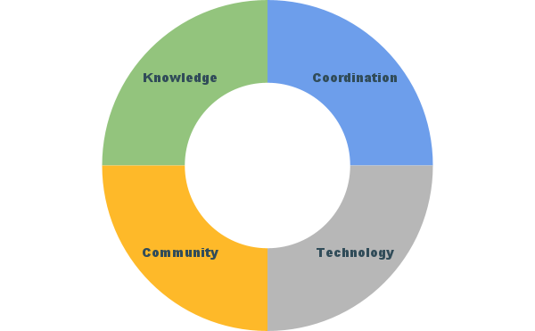

# BTAA-GIN Committees

## Executive Committee

Represents the strategic and financial interests of participating institutions through executive oversight of the project

**Members**

* Lisa German- Dean of Libraries & University Librarian, Minnesota - Chair
* Beth McNeil- Dean of Libraries, Purdue
* Faye Chadwell - Dean of Libraries, Pennsylvania State University
* Cody Hanson (ex-officio)- Director, Web Development Minnesota
* Maurice York (ex-officio)- Director of Library Initiatives, Big Ten Academic Alliance

## Program Committees

### Technical Operations Committee

*Building the Geoportal*

* Daniel Dotson
* Caroline Kayko
* Melinda Kernik
* Shirley Li
* Karen Majewicz (Co-Chair)
* Jaime Martindale
* Meg Mering  (Co-Chair)
* Ronda Sewald

### Community Engagement Committee

*Connecting with the public*

* Tara Anthony
* Jay Bowen (Co-Chair)
* Laura McElfresh
* Sue Oldenburg (Co-Chair)
* Nicole Scholtz
* Kathleen Weessies

### Knowledge Committee

*Enhancing our professional community*

* Milan Budhathoki
* Sandi Caldrone
* Catherine Hodge
* Josh Sadvari (Co-Chair)
* Amanda Tickner (Co-Chair)
* Wenjie Wang

### Coordination Committee

*Organizing our program*

* Ryan Mattke (Chair)
* Karen Majewicz
* TBD - nominated members of other committees

