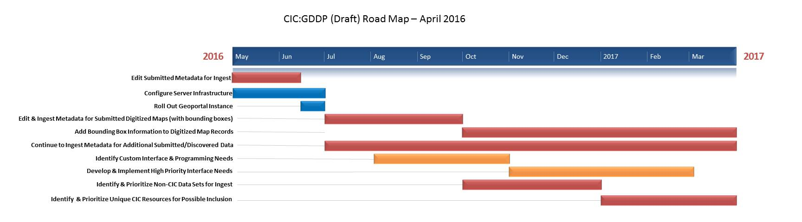

# CIC Geospatial Data Discovery Project Update April 2016

<!-- more -->

## April Activities

### CIC Geospatial Task Force Meetings

Monthly, virtual meetings of the CIC Geospatial Task Force (members from all participant institutions). Topics included:

-   Status updates from each institution

-   GeoNetwork walkthrough

-   Promotion & Outreach

-   Creation of a Steering Group for interface customization

-   Future plans: Roadmap April 2016

### GeoNetwork Launch

GeoNetwork, the collaborative geospatial metadata editor for the
project, was launched this month. So far, over 7,100 records have been
added.

### Promotion & Outreach

Several task force members worked together to create a conference poster
that was presented at the Association of American Geographers Annual
Meeting in San Francisco. Task force members also presented at the CNI
Forum in San Antonio and the Digital Approaches to Cartographic Heritage
Conference in Riga, Latvia.

### GeoNetwork Training

An 11 minute screencast that walks through basic GeoNetwork navigation
was created. The walkthrough was also presented to the task force
participants at the April meeting.

## Work in Progress

### Second Round of Records

Participant institutions began work to transform and edit metadata
records submitted in February. Work is being done in GeoNetwork and on
spreadsheets exported from GeoNetwork.

### Digitized Maps

Progress was made in developing the workflow for scanned map records
that includes harvesting from OAI-PMH seeds, importing into MarcEdit,
making minor edits, and exporting to simple Dublin Core files that can
be re-imported into GeoNetwork.

### GeoBlacklight Server

Progress is being made on the production instance of GeoBlacklight.
Server should be available in mid-May.

## Next Steps

-   Continue processing the second round of metadata records

-   Develop workflows for including digitized maps in the geoportal by the end of May

-   Initial configuration of GeoBlacklight server instance will be
completed by the end of May
