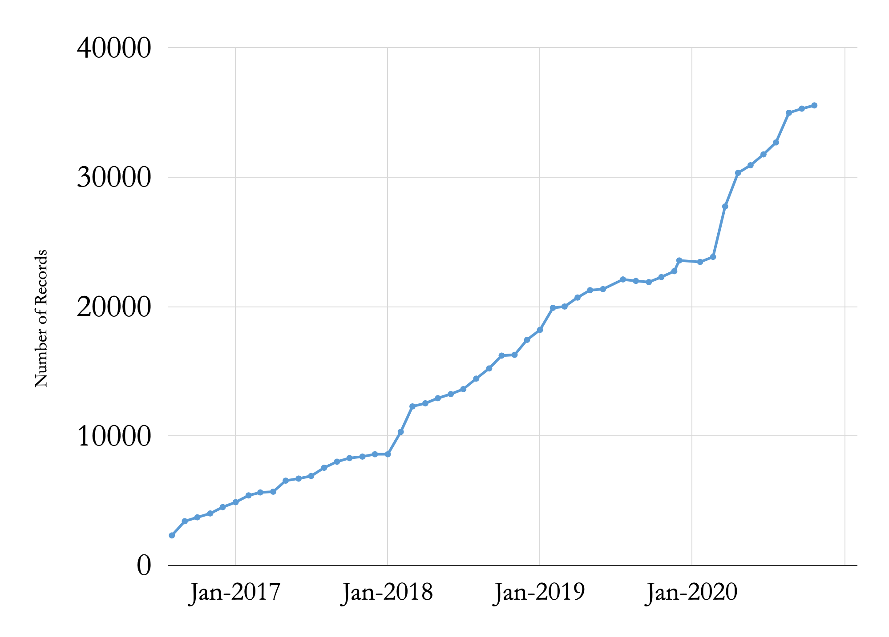

__Big Ten Academic Alliance Geospatial Data Project__

__Project Update: __  _October 2020_

_[BTAA Geoportal](https://geo.btaa.org/)_

_[BTAA GDP Project Website](http://z.umn.edu/btaagdp)_

_[Monthly Project Updates](https://sites.google.com/umn.edu/btaa-gdp/about/activities/project-reports)_

__Table of Contents__

__Project Highlight for October__

_The Education Outreach Working Group_

_Our project has long been looking for opportunities to become more integrated into curriculums across the BTAA in order to more directly support students and faculty\.  We have begun to address this need through the activities of the Education Outreach Working Group\._

_This working group\, co\-chaired by Josh Sadvari \(The Ohio State University\) and Ryan Mattke \(University of Minnesota\)\, convened in late summer and has already published a series of _  _[tutorials](https://sites.google.com/umn.edu/btaa-gdp/tutorials)_  _\. These tutorials showcase how the BTAA Geoportal can facilitate teaching and learning about maps\, geospatial data\, and GIS techniques\. They cover a wide range of activities designed to meet the needs of instructors and students in different fields and levels of competency in data retrieval\, use\, and analysis\._

_The Education Outreach Working Group Phase I sunsetted and Phase II\, which _  _will include additional tutorials\,_  _ is under development\. The group will also coordinate with the new Diverse Collections Working Group to select _  __educational disciplines to be targeted for outreach and identify geospatial resources in the geoportal that would be useful to the selected disciplines\.__

__Statistics: Item Records__

Total Item Records

__35\,550__

October 2020 actions

_New records: 222_

_New collections: 1_

__Statistics: Geoportal Users__

__Geoportal users for the months of October \(2016\-2020\)__

__Statistics: Top Pages__

| Top Geoportal Items | Top Downloaded Items | Top blog post |
| :-: | :-: | :-: |
|  Wisconsin Historic Aerial Imagery Finder (Aerial Photos 1937-41) (154)   PennPilot (Historical Aerial Photo Library): Pennsylvania (73)   Evansville City Limits: Vanderburgh County, Indiana, United States (59) |  PennPilot (Historical Aerial Photo Library): Pennsylvania (16)   Historic County Boundaries and Total Population: United States, 1880 (12)   Brown Co-parcel: Brown County, Ohio (10) |  Geospatial Data Project: Tutorials (43)   |

__Activities: Committees__

__Metadata Committee__

__Led a scanned maps metadata cleanup sprint__

__Developing a MARC to GeoBlacklight crosswalk for spatial fields__

__Collection Development Committee__

__Issued the charge for a Diverse Collections Working Group__

__Updating Collections Strategy to address scanned maps__

__Communications Committee__

__Directed and reviewed project website reorganization including a new __  _[homepage](https://sites.google.com/umn.edu/btaa-gdp/home)_  __ and two new menu sections__

__Began developing a Google Ads campaign__

__Interface Committee__

__Finalized online user testing plans__

__Scheduled tests for November__

__Activities: Working Groups__

__Education Outreach Working Group__

__Published 6 tutorials on website__

__Recruiting new members for a __  _[Phase 2](https://docs.google.com/document/d/1kJvKfZ9iZAgxlL_HWs6lpEronOQOFtidLi5-VEYXb1w/edit?usp=sharing)_  __ group__

__Licensed Data Working Group__

__Processing and ingesting one more licensed database__

__Refining layout of existing records__

__Diverse Collections Working Group__

__Issued __  _[charge](https://docs.google.com/document/d/1_lFlwsvqfs-Vtcr8OHoRGJA88MLApXkvY_sHR6bqOIQ/edit?usp=sharing)_  __ and currently recruiting members__

_Conduct remote _  _User Interface Testing _  _with student workers across the BTAA between November 6\-13\. This will be our 3rd round of qualitative testing of the BTAA Geoportal interface\. Previous rounds resulted in significant design changes and a _  _[published article in the Code4Lib journal](https://journal.code4lib.org/articles/12932)_  _\._

_Hold the first _  _[BTAA GIS Conference](https://sites.google.com/umn.edu/btaa-gdp/btaa-gis-conference-2020)_  _ on November 13\, 2020\. This virtual conference will feature presentations\, social hours\, career networking\, a map contest\, a geo\-trivia night\, and an Open Humanitarian Mapathon\. We will also be highlighting GIS educational programs across the BTAA\. As of this writing\, over 200 people have signed up to attend\._
