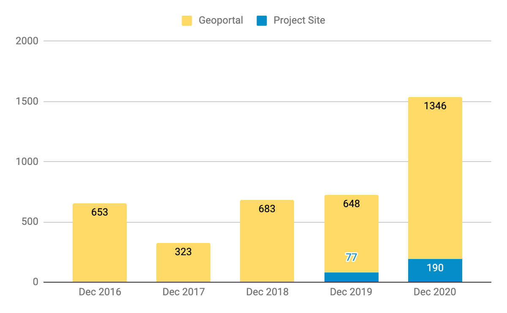

__Big Ten Academic Alliance Geospatial Data Project__

__Project Update: __  _December 2020_

__Table of Contents__

Project Highlight for December

__Two New Working Groups: __

_Education Outreach \(phase 2\) _ and _ Diverse Collections_

_Our project has entered an exciting new phase in which we are increasing our efforts towards directly facilitating teaching\, learning\, and our service to the academic community\. This is evident in our two newest Working Groups \(WG\)\. _

_The _  _Education Outreach WG_  _\, which published _  _[six tutorials](https://sites.google.com/umn.edu/btaa-gdp/tutorials)_  _ in the Fall of 2020\, has regrouped for a phase 2\. The WG plans to identify educational disciplines to be targeted for outreach \(ex\. public health\, urban planning\, environmental studies\, etc\.\)\, and follow up by identifying resources in the geoportal that could be useful to the selected disciplines\._

_The _  _Diverse Collections WG_  _ will kickoff in January and will be defining and assessing diversity across the geoportal collection\.  They will then identify thematic datasets and create collections of resources that could be useful in research and teaching on social\, racial\, economic\, and environmental justice topics_

Statistics: Item Records

Total Item Records

__37\,744__

December 2020 actions

_New records: 1959_

_Retired records: 20_

Statistics: Geoportal & Blog Users

__Geoportal & Project Site\* users for the months of December \(2016\-2020\)__

__\*Blog\, Help\, Tutorials\, Conference info__

Statistics: Top Pages

| Top Geoportal Items | Top Downloaded Items | Top blog post |
| :-: | :-: | :-: |
|  Wisconsin Historic Aerial Imagery Finder (Aerial Photos 1937-41) (226)   PennPilot (Historical Aerial Photo Library): Pennsylvania (70)   Remonumented Section Corners: Michigan (45) |  Anacostia Waterfront Development Zone: District of Columbia (20)   Counties: Minnesota, 2010 (18)   PennPilot (Historical Aerial Photo Library): Pennsylvania (16) |  An Interview With  Aaron Schill, Director of Data & Mapping at Mid-Ohio Regional Planning Commission (MORPC)  (58)     |

Activities: Committees

__Metadata Committee__

__Developing a MARC to GeoBlacklight crosswalk for spatial fields__

__Collection Development Committee__

__New collection strategies document has been finalized by committee and is ready for review by steering__

__Communications Committee__

__Scheduled Blog Post sprint for January 29__

__Interface Committee__

__Developed Analysis Plan for assessing user interface tests__

Activities: Working Groups

* __Education Outreach Working Group__
* __Held kickoff meeting__
* __Licensed Data Working Group__
* _[Completed final report](https://docs.google.com/document/d/1xXx3WYJV-16j08rsb0Oe5htn-ZkrZyaQZaMt2ETmEJQ/edit?usp=sharing)_  __ \- to be approved by Steering__
* __Diverse Collections Working Group__
  * __Finalized members__
  * __Scheduled kick\-off meeting for Jan\. 20__

_We plan to put GEOMG\, our custom metadata editor\, into production mode\. This will entail hosting it on a paid platform and integrating it with the Geoportal_

_Two BTAA Task Force members are serving on the GeoBlacklight Metadata Schema Workgroup\, which plans to release a new version of the schema in January\. This will be followed by a Winter Code Sprint to incorporate the new schema into the GeoBlacklight code base\._

__The Communications Committee is gathering keywords for a Google Ads campaign to be run in spring 2021\. We will be looking to see if this experiment brings additional users to the Geoportal\.__
