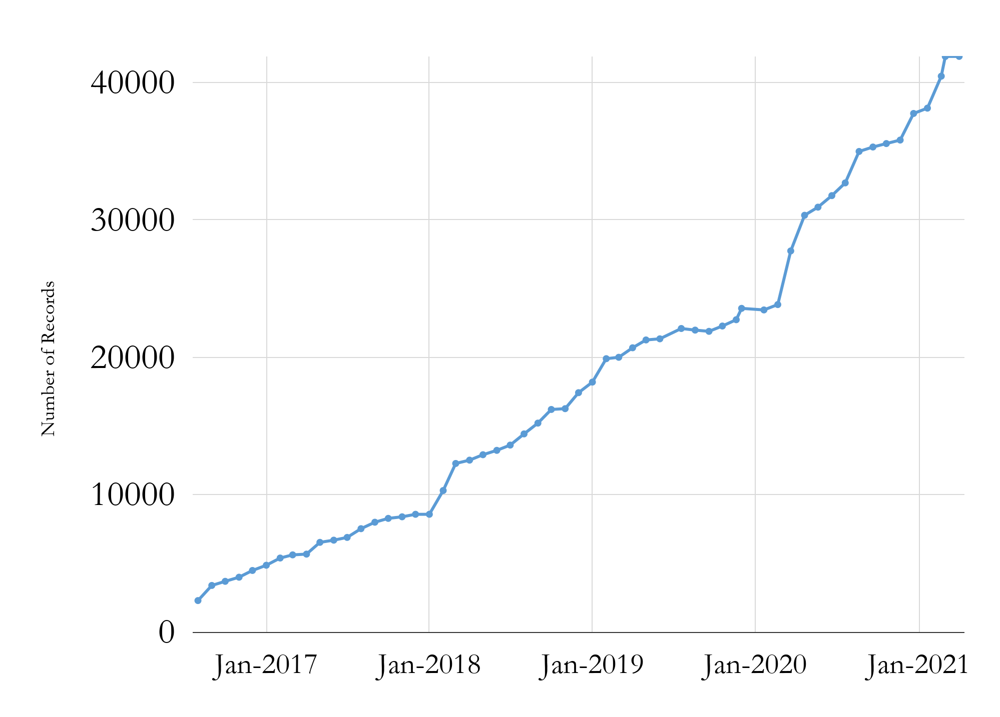
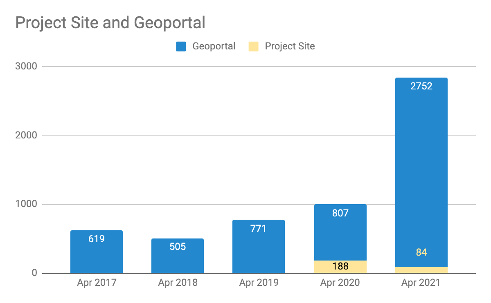

__Big Ten Academic Alliance Geospatial Data Project__

__Project Update: __  _April 2021_

__Table of Contents__

Project Highlight for April

__Google Ad Campaign to reach new users__

In anticipation of the increased traffic that occurs towards the end of academic semesters\, we experimented with a Google Ad Campaign to reach new users\. We set up three targeted pages:

The  _[homepage](https://geo.btaa.org)_  \(generated 538 new users between Apr 12\-May 4\)

A landing page as a search query for  _[Aerial Photography](https://geo.btaa.org/?utf8=%E2%9C%93&search_field=all_fields&q=aerial+photography)_   __ \(generated 178 new users between Apr 22\-May 4\)__

A landing page for the  _[Chicago Social Sciences Historical Map](https://geo.btaa.org/catalog?f%5Bdct_isPartOf_sm%5D%5B%5D=12d-01)_  collection  __\(generated 48 new users between Apr 28\-May 4\)__

__The total number of new users was 763\, and the cost of these campaigns totaled less that $200\. __  _[See full report\.](https://docs.google.com/document/d/1AKlwbLT172qacAdLMv76panauUaZhJ_6b6KMW4BKTB8/edit?usp=sharing)_

__In the course of preparing for this campaign\, we gathered input from Task Force members on which items would benefit from ads\. These could serve as landing pages for future campaigns\.__

Statistics: Item Records

Total Item Records

__41\,893__

Apr\. 2021 actions\*

_New records: 8_

\* New records that were submitted in April are presently queued as the geoportal undergoes a metadata upgrade\. They will be published in early May\.

Statistics: Geoportal & Blog Users

__Geoportal & Project Site\* users for the months of April \(2017\-2021\)__

__\*Blog\, Help\, Tutorials\, Conference info__

Statistics: Top Pages

| Top Viewed Items | Top Downloaded Items |
| :-: | :-: |
|  Wisconsin Historic Aerial Imagery Finder (Aerial Photos 1937-41) (280)  PennPilot (Historical Aerial Photo Library): Pennsylvania (74)  Property Parcels: Prince George's County, Maryland (69) |  Voting Precincts: Michigan, 2014 (17) PennPilot (Historical Aerial Photo Library): Pennsylvania (14) Height Modernization (ILHMP) LiDAR Data: Illinois (12) |

Activities: Committees

__Metadata Committee__

__Prepared and scheduled a metadata sprint for May__

__Collection Development Committee__

__Scheduled a Collections sprint for June__

__Communications Committee__

__Launched Google Ads campaign__

__Developing next round of blog posts as interviews__

__Interface Committee__

__Collectively filling out a matrix to compile recommended actions for usability__

Activities: Working Groups

* __Education Outreach Working Group \(phase 2\)__
* __Working on tutorial drafts__
* __Diverse Collections Working Group__
  * _[Developing framework](https://docs.google.com/document/d/1lqS9M4MGa9Gj4yEH2ACezukdqDPdw8Z9yhUpbSiG6hc/edit?usp=sharing)_  __ for defining next steps__
* __Help Pages Sprint Group__
* Published 3 research guides on finding licensed data\, fire insurance maps\, and Public Land Survey plats

_May_  _\-June_  _:  Move the metadata editor and upgraded geoportal with upgraded metadata schema into production\. _  _[See this roadmap for timeline\.](https://airtable.com/shr96lKbYiXpyvGpi)_

_May_  _: Conduct metadata sprint_

_June_  _: Conduction collections sprint_

_July_  _: WAML/Magirt webinar presented by all committee chairs_
