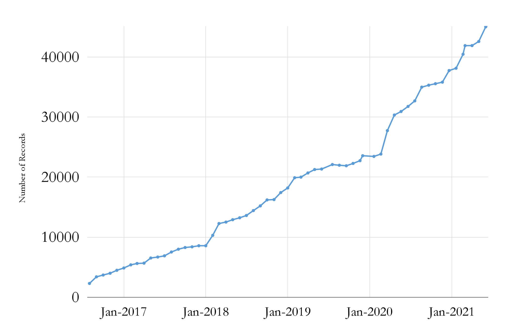
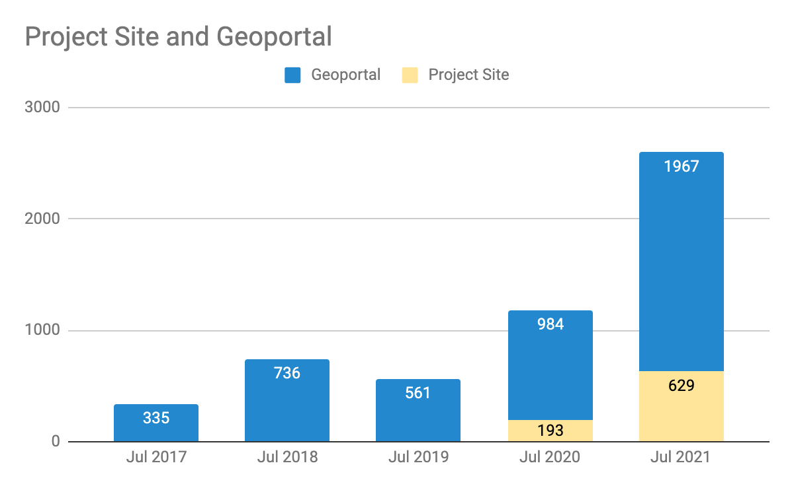

__Big Ten Academic Alliance Geospatial Data Project__

__Project Update: __  _July 2021_

__Table of Contents__

Project Highlight for July

__MAGIRT/WAML Webinar__

__Seven project members co\-presented a webinar titled “Big Ten Academic Alliance Geospatial Data: innovation and collaboration” for the map and geography professional organizations MAGIRT and WAML\. __

__The talk diverged from most of our previous presentations in that it focused on our current collaborative committee work more than the general project genesis and structure\. Topics included our educational tutorials\, the Diverse Collections working group\, application development\, usability testing\, promotional activities\, and our sprint model for collections\, metadata\, and blog posts\.__

_[Watch a recording of the webinar here\.](https://waml.org/resources/btaa-geospatial-data-project-magirt-waml-webinar-9-july-2021/)_

Statistics: Item Records

* Total Item Records
* __45\,160__
* July 2021 actions
* __New record sources__
  * 143 mixed ArcGIS portal records
  * 37 mixed CKAN portal records

Statistics: Geoportal & Blog Users

__Geoportal & Project Site\* users for the months of July \(2017\-2021\)__

__\*Blog\, Help\, Tutorials\, Conference info__

Statistics: Top Pages in July

| Top Viewed Collection Pages | Top Viewed Item Pages | Top Downloaded Items |
| :-: | :-: | :-: |
| Wisconsin Historic Aerial Imagery Finder (Aerial Photos 1937-41) (191) Digital Sanborn Maps (Black & White): All States, 1867-1970 (116) General Land Office Township Plats: Michigan (29)+  | Digital Sanborn Maps (Black & White): Massachusetts (76)+  Digital Sanborn Maps (Black & White): Virginia (47)+  Digital Sanborn Maps (Black & White): Michigan (47)+  Research Guide to Restricted or Licensed Data (47)+  Flood Hazard Areas: Stark County, Ohio (42)+  | Traffic Analysis Zones, Council of Governments: Prince George's County, Maryland (9)+  Research Guide to Restricted or Licensed Data (7)+  51N 37W - Survey Map of Bohemia Township, Ontonagon County, and Elm River Township and Laird Township, Houghton County: Michigan (7)+  General Land Office Township Plat - Original Survey: Minnesota (T038N R22W), 1852 (7) +  |

__\+__  New to top pages

Activities: Committees

__Metadata Committee__

__Met in July with new co\-chair and updated charter__

__Discussed Interface Usability Study Report and Diverse Collections language proposal__

__Planning to discuss Publisher/Creator/Contributor terms at our next meeting __

__Collection Development & __  __Education__  __ Outreach Committee__

__Reformed as dual committee__

__Co\-chairs met in July to determine scheduling\, structure\, and agendas__

__Planning first meeting in August with new members__

__Communications Committee__

__Planning first meeting in August with new members__

__Interface Committee__

__Met in July with new co\-chairs and updated charter__

__Working on final follow\-ups to user testing feedback/suggestions__

__Proposing that other committees/working groups would visit Interface throughout this academic year\.__

__Proposing “sprints” that would focus on interface functions/ideas\.__

Activities: Working Groups

* __Education Outreach Working Group \(phase 2\)__
* __Sunsetted group__
* __New tutorials ready to be published on project website__
* __Diverse Collections Working Group__
  * Work on summer projects is ongoing
  * Encouraging the group to surface “radical” ideas to bring to steering/task force and that could possibly inform the work of various committees during the current two\-year term
  * Finalizing abstract for presentation at the WAML virtual conference \(Oct\. 26\-29\)

* _August: _
  * _New / Reorganized Committee chairs and members to meet_
  * _Kickoff planning meeting for the second BTAA GIS Virtual Conference this fall_
