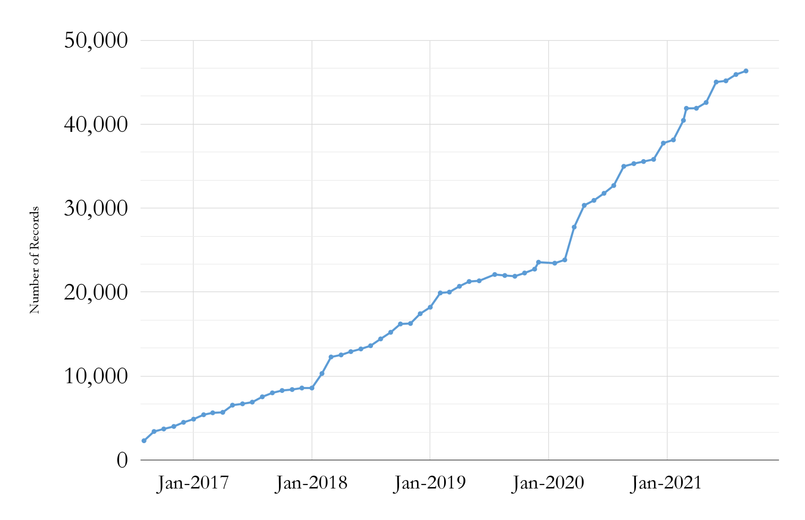

__Big Ten Academic Alliance Geospatial Data Project__

__Project Update: __  _September 2021_

__Table of Contents__

Project Highlight for September

GeoBlacklight version 4\.0 Alpha

The GeoBlacklight Community recently completed another Summer Sprint\, held from August 30 to September 3\, 2021\. Staff members of the BTAA GDP provided leadership roles for the Usability and the Application Development tracks\.

The overarching goal of this sprint was to develop a Version 4 alpha release to support the  _[Aardvark Metadata Profile](https://opengeometadata.github.io/docs/aardvarkSchema)_ \. Other activities included maintenance updates\, updating the project website\, assessing existing metadata tools\, and improving the application’s fixture \(sample\) metadata records\.  _[Read more on the GeoBlacklight blog here\.](https://geoblacklight.org/blog/%7C/sprint/2021/09/07/summer-sprint-2021.html)_

Statistics: Item Records

* Total Item Records
* __46\,336__
* September 2021 actions
* __New record sources__
  * 394 \(MN scanned maps\)
* __Retired records__
  * 126 \(mixed public geodata items\)

Statistics: Geoportal & Blog Users

__Geoportal & Project Site\* users for the months of September \(2017\-2021\)__

__\*Blog\, Help\, Tutorials\, Conference info__

Statistics: Top Pages in September

| Top Viewed Collection Pages | Top Viewed Item Pages | Top Downloaded Items (212) |
| :-: | :-: | :-: |
| Wisconsin Historic Aerial Imagery Finder (Aerial Photos 1937-41) (184) Digital Sanborn Maps (Black & White): All States, 1867-1970 (154) City of Baltimore GIS Open Data  (36) | Digital Sanborn Maps (Black & White):  Michigan (79)  Virginia (53) Illinois (52) Ohio (48) California (42) Massachusetts (42) Research Guide to Restricted or Licensed Data (46)  Remonumented Section Corners: Michigan (37) | Key Sheet Grid: Baltimore County, Maryland(6) +  Building Footprints: Cuyahoga County, Ohio, 2016 (6)  Kent County Parcel Data: Grand Rapids, Michigan  (4) +  Research Guide to Restricted or Licensed Data (4)  Topography 2 Foot Contours: Washington, D.C. (4) + Contour 2ft: City of Baltimore, Maryland (4) |

__\+__  New to top pages

Tech Roadmap: Q4 2021

Activities: Committees

__Metadata Committee__

__Proposing change to Publisher/Creator/Provider usage__

__Collection Development & __  __Education__  __ Outreach Committee__

__Updated Charter__

__Looking at projects for shared prioritization__

__Communications Committee__

__Held Blog post sprint__

__Looking to recruit additional members__

__Working on a Social Media plan__

__Interface Committee__

__Created a __  _[User Testing Summary Matrix](https://docs.google.com/document/d/1gCsETSWtGLnbZhdPzqjmP_z60j784_HXwgGr4YwMmJM/edit?usp=sharing)_

__Planning a usability sprint on November 18__

Activities: Working Groups

* __Diverse Collections Working Group__
  * Preparing to present at the WAML virtual conference \(Oct\. 26\-29\)

_October: Diverse Collections Working Group to present to Western Association of Map Libraries Conferences_

_November 12: Second BTAA GIS Virtual Conference_

_October\-December: Geoportal homepage and interface design refresh_
