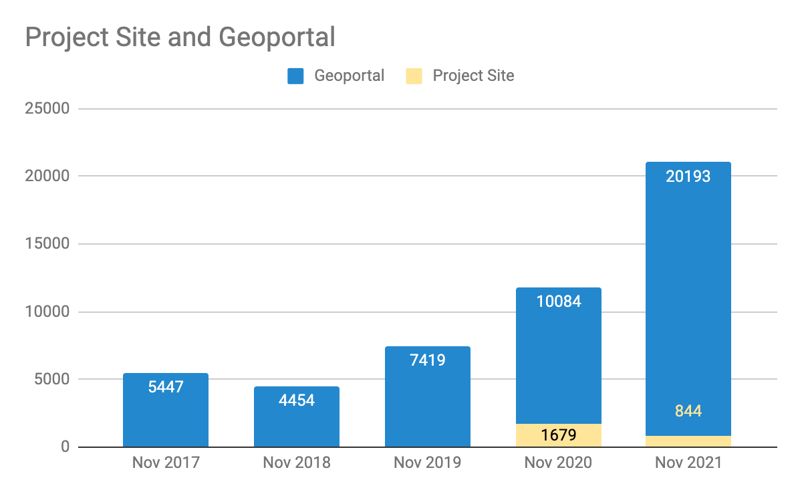
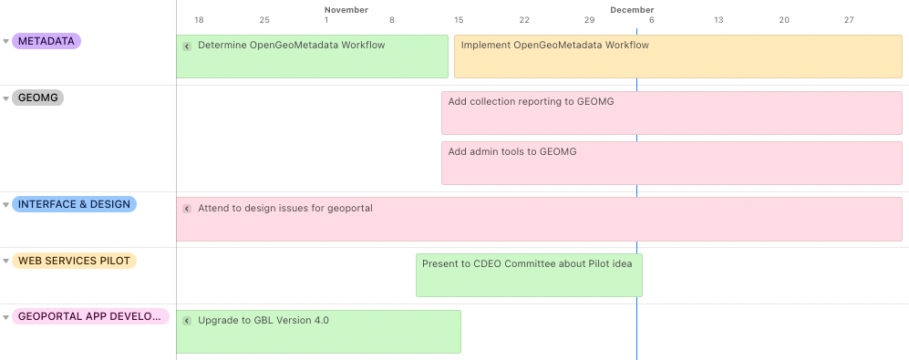

__Big Ten Academic Alliance Geospatial Data Project__

__Project Update: __  _November 2021_

__Table of Contents__

Project Highlight:BIG Convening

_Three project members presented at the BTAA Libraries BIG Collection Convening on November 8th\. Topics covered included our project’s _  _origins_  _ and structure\, our accomplishments\, a spotlight on the Diverse Collections Working Group\, and how we fit into the goals of the BIG Collection\. View the talk below:_

Statistics: Item Records

* Total Item Records
* __46\,632__
* November 2021 actions
* __New records__
  * 192 \(Humanitarian Exchange\)
  * 2 \(Open ICPSR\)
* __Retired records__
  * 157 \(mixed public geodata items\)

Statistics: Geoportal & Blog Page Views

__Geoportal & Project Site\* page views for the months of November \(2017\-2021\)__

__\*Blog\, Help\, Tutorials\, Conference info__

Statistics: Top Pages in October

| Top Viewed Collection Pages | Top Viewed Item Pages | Top Downloaded Items (392) |
| :-: | :-: | :-: |
| Wisconsin Historic Aerial Imagery Finder (Aerial Photos 1937-41) (356) Digital Sanborn Maps (Black & White): All States, 1867-1970 (196) Fire Insurance Maps Online (FIMo): All States (60) PennPilot  (Historical Aerial Photo Library): Pennsylvania (43) | Digital Sanborn Maps (Black & White):  Michigan (101)  Massachusetts (65) California (64) Texas (61) New Jersey (61)  Big Game Check Stations: Nebraska (99)+ Remonumented Section Corners: Michigan (56) Current Tax Sale List: City of Baltimore, Maryland (44) |  Indiana Roads from INDOT and TIGER Files: Indiana (24) +  Remonumented Section Corners: Michigan (11) School District Boundaries: Franklin County, Ohio (9)+  Confined Feeding Operation Facilities: Indiana (9)+  |

__\+__  New to top pages

Tech Roadmap: Q4 2021

Activities: Committees

__Metadata Committee__

__Next__  __ __  _[Metadata sprint](https://docs.google.com/document/d/1KWUYnhxO52JtAUCpkCaTMEbrjc3YzjdN-woMB2yptBo/edit)_  __ scheduled for December 3\, 2021\. Tasks will include: adding missing language codes\, fixing broken links\, standardizing “Creator”\, investigating bounding box errors__

__Collection Development & __  __Education__  __ Outreach Committee__

__Reviewed __  _[web services pilot proposal](https://docs.google.com/document/d/1Umn2jdio6VNOId3PxaUZQ__RXVzAZB6RCnTBrLX7Cpw/edit)_  __ as part of CDEO’s activities for the coming year__

__Considering collection development policy review__

__Planning to date our existing PowerPoint templates for accessibility__

__Communications Committee__

__Next __  _[Blog Sprint](https://docs.google.com/document/d/1wcv1KVYJP-XRnuh9z3KW55y00y5r5gXQnRUJT8s99oM/edit#)_  __ is scheduled for Jan 2022__

__Completed __  _[Charter](https://docs.google.com/document/d/1I19qSEgpe-Ov7qdnYgoqE9B4KRTKj9FpNUP-z2Qz1I0/edit)_  __ and__  ____  _[Strategy](https://docs.google.com/document/d/1qTkjex8Whj2BY0YQ_dqKNoQVkJxlhRkb8VAfN210tr8/edit#heading=h.5vporvl34w1n)_

__Planning to migrate blog to the Blogger platform__

__Interface Committee__

__First sprint had several attendees and 21 “issues” found\.  __  _[See more details](https://docs.google.com/spreadsheets/d/1TKX57a8sAVAjdrQQ4IlcGwdiSqFpnH6Znygrb87Lg90/edit?usp=sharing)_

Activities: Working Groups

__Diverse Collections Working Group__

__Working on draft report for December 15 DCWG meeting__

__Inspired by work of this group and discussion at WAML\, there is a current CFP for a special issue of JMGL with the Working Group chairs as two of the co\-editors\. Currently promoting CFP and inviting submissions\.__  ____  _[More info and abstract submission here](https://forms.gle/5f6y27TeTziTZNxv7)_  __ \(by Dec\. 13\)\.__

__BTAA GIS Conference Planning Group__

__Held 2nd annual BTAA GIS Conference on November 12th__

__Compiling retrospective conference report__

* _December_  _: _
  * _Develop new feature for _  _collection_  _ reports exports from GEOMG_
  * _Metadata Sprint_
* _January_
  * _Diverse Collections Working Group to sunset_
  * CDEO Committee to gather resource lists for web service pilot
  * Blog Post Sprint
* February
  * Geo4LibCamp
  * GeoBlacklight Community Sprint
