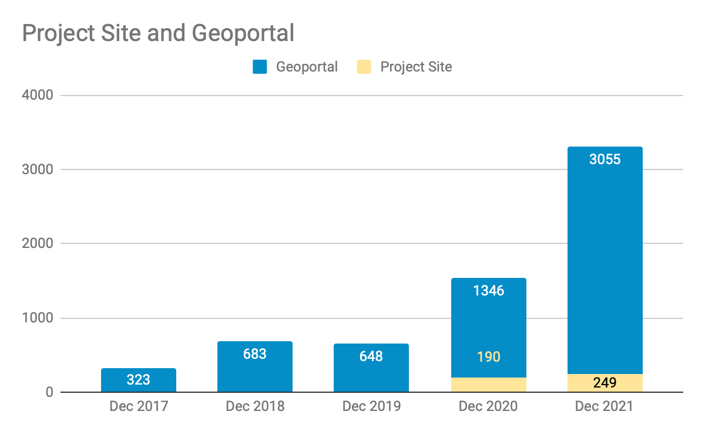

__Big Ten Academic Alliance Geospatial Data Project__

__Project Update: __  _December 2021_

__Table of Contents__

Project Highlight: BTAA GIS Conference

__The second annual BTAA GIS Conference\, held on November 12th\, 2021\, provided an opportunity for students and educators in the Big Ten institutions to present their geospatial work\, exchange information\, and develop potential collaborations\. The one\-day conference included two keynote addresses\, presentation sessions\, lightning talks\, a career panel\, and __  _[a map gallery](https://sites.google.com/umn.edu/btaa-gdp/btaa-gis-conference/btaa-gis-conference-2021/2021-map-gallery)_  __\.  __  __162 people registered for the conference\, representing 47 unique institutions or affiliations\. On the day of the conference\, there were 96 unique attendees\.__

__A highlight of this year’s conference was the two keynote addresses\.__  __ The BTAA GDP provided speaker honorariums for the first time\, and the talks __  __described significant and inspiring projects/programs: __

__American Domesday__  __\, by Dr\. Robert Lee\, discussed his newest work to spatially analyze public lands in the American West\. After the __  __conference__  __\, we added __  _[geoportal records](https://geo.btaa.org/catalog/HCN-Digital-Projects_landgrabu-data)_  __ for Lee’s related work on “Land Grab Universities\.” __

__The Population Data Buffet__  __\, by Dr\. Tracy Kugler\, described the many types of population data with a focus on __  _[IPUMS](https://www.ipums.org)_  __\. The __  _[geoportal features several web services](https://geo.btaa.org/catalog?f%5Bdct_source_sm%5D%5B%5D=05d-10)_  __ of historical county boundaries derived from the National Historical GIS\, a project within IPUMS\.__

_[More details on the conference can be found here\.](https://sites.google.com/umn.edu/btaa-gdp/btaa-gis-conference)_

Statistics: Item Records

* Total Item Records
* __47\,852__
* December 2021 actions
* __New records__
  * 519 government layers
  * 333 library maps
  * 133 Indigenous lands datasets
* __Retired records__
  * 46 \(mixed public government items\)

Statistics: Geoportal & Blog Users

__Geoportal\, Project Site\, Blog users for the months of December \(2017\-2021\)__

Statistics: Top Pages in October

| Top Viewed Parent Pages | Top Viewed Item Pages | Top Downloaded Items (267) |
| :-: | :-: | :-: |
| Wisconsin Historic Aerial Imagery Finder (Aerial Photos 1937-41) (298) Digital Sanborn Maps (Black & White): All States, 1867-1970 (106) Fire Insurance Maps Online (FIMo): All States (55) | Digital Sanborn Maps (Black & White):  Michigan (62)  California (58) New Jersey (57)  Research Guide to Restricted or Licensed Data (56) Current Tax Sale List: City of Baltimore, Maryland (44) Remonumented Section Corners: Michigan (39) | Indiana Roads from INDOT and TIGER Files: Indiana (34) Historic County Boundaries and Total Population: United States, 1880 (7) Colleges and Universities: Indiana (5)+  Airport Locations [Iowa] (5)+  Active Mines in the Danville Coal Member: Indiana (5)+ |

__\+__  __ __ New to top pages

Tech Roadmap: Q1 2022

In progress:

Migrate geoportal to AWS

Enable collection statistics reporting from GEOMG

To Do

Incorporate asset storage \(XML files\, thumbnails\) into GEOMG

Integrate administrative Rake tools \(Broken link reports\, thumbnail harvests\) into GEOMG

Refine GeoBlacklight version 4\.0 during February GeoBlacklight sprint

Activities: Committees

__Metadata Committee__

__Held December 3rd sprint to fix missing language codes\, broken links\, strategize how to tackle Creator field\, identify bounding box errors__

__Sprint participants added 700\+ missing language values\, fixed 50\+ broken links\, brainstormed a strategy document for future Creator field work\, and identified records with bounding box errors__

__Next: standardize Creator values and review the Citation widget __

__Collection Development & __  __Education__  __ Outreach Committee__

__Planning a February sprint around outreach__

__Talked about the web services pilot proposal and identifying candidate projects__

__Will be reviewing and updating the Collection Development Policy soon__

__Reviewing Powerpoint and Google slides templates for accessibility__

__Communications Committee__

__Next blog Sprint is Friday\, Jan 21__

__Interface Committee__

__We will be working on possibilities for updates based upon our previous user testing and more recent sprint\.__

__Upcoming guests: Communication in February and CDEO in March__

Activities: Working Groups

__Diverse Collections Working Group__

__Submitted __  _[Diverse Collections Working Group Summary Report \(Draft\)](https://docs.google.com/document/d/1RZFN0P7kCFqym4ag0KZjKmcWu0JIRJ13DliWtUCHdNc/edit?usp=sharing)_

__Report accepted ‒ group will sunset__

__Recommendations will be carried forward by Steering Committee and incorporated into all committee charters__

__BTAA GIS Conference Planning Group__

__Wrapping up report and planning to publish videos__

* _January_
  * _Diverse Collections Working Group to sunset_
  * CDEO Committee to gather resource lists for web service pilot
  * Blog Post Sprint
* February
  * Geo4LibCamp
  * GeoBlacklight Community Sprint
