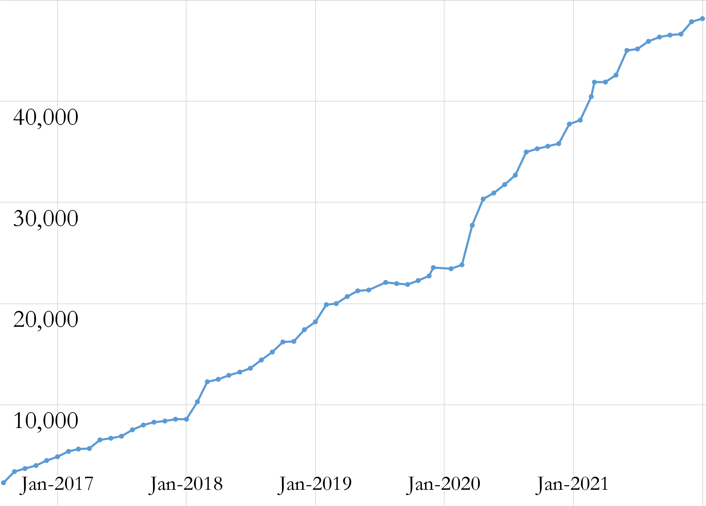
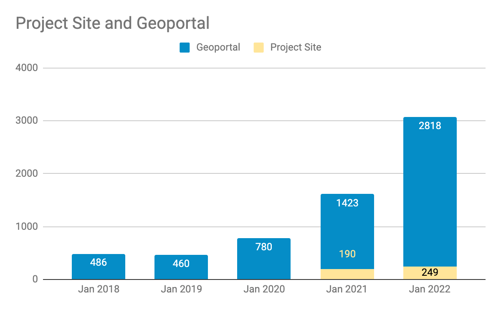

__Big Ten Academic Alliance Geospatial Data Project__

__Project Update: __  _January 2022_

__Table of Contents__

Project Highlight: OpenGeoMetadata

OpenGeoMetadata is a collaborative initiative that began around the same time the GeoBlacklight application was developed \(~2015\)\. The primary goal has been to facilitate sharing metadata across institutions that have adopted GeoBlacklight\. It uses GitHub as the sharing platform and includes  _[metadata tools](https://github.com/OpenGeoMetadata/GeoCombine)_ \, best practices\, and the  _[GeoBlacklight schema documentation](https://opengeometadata.github.io/docs/aardvarkSchema)_ \.

Our initial participation in OpenGeoMetadata was hampered by the instability of the BTAA Geoportal’s earliest GIS open data collections; it was impractical to share metadata records for open data items that were regularly retired and replaced\. However\, as our collection has grown\, we have incorporated many resources from institutional repositories that feature quality metadata and stable access points\. Examples of these records are found in our  _[Libraries Geospatial Data Collection](https://geo.btaa.org/catalog/dc8c18df-7d64-4ff4-a754-d18d0891187d)_  and our  _[Libraries Historical Maps Collection](https://geo.btaa.org/catalog/64bd8c4c-8e60-4956-b43d-bdc3f93db488)_ \.

Therefore\, in recent months\, we have re\-committed to  _[sharing our metadata](https://github.com/OpenGeoMetadata)_  through OpenGeoMetadata and created repositories for each participating institution\. These records have been picked up by other geoportals\, including Princeton’s  _[Digital Maps & Geospatial Data](https://maps.princeton.edu/)_ \. In the future\, we plan to share our curated resources that would be of interest to the wider community\, including our  _[Indigenous Lands collection](https://geo.btaa.org/catalog/0e83a535-733c-4be6-a96e-cdd95fba3101)_ \.

Statistics: Item Records

* Total Item Records
* __48\,160__
* January 2022 actions
* __New records \(640\)__
  * 333 Maps
  * 251 Datasets
  * 33 Web services
  * 22 Imagery
  * 1 Website

Statistics: Geoportal & Blog Users

__Geoportal and Project Site users for the months of January \(2018\-2022\)__

Statistics: Top Pages in January

| Top Viewed Parent Pages | Top Viewed Item Pages | Top Downloaded Items (267) |
| :-: | :-: | :-: |
| Wisconsin Historic Aerial Imagery Finder (Aerial Photos 1937-41) (269) Digital Sanborn Maps (Black & White): All States, 1867-1970 (90) Fire Insurance Maps Online (FIMo): All States (55) | Current Tax Sale List: City of Baltimore, Maryland (88)+  Digital Sanborn Maps (Black & White):  New Jersey (80) Illinois (70) Michigan (70)   A map of the Garden of Eden, before God destroy'd it with the flood. (65) +  Snow Plow Camera Images (Iowa DOT) [Iowa] (65) +  | Bedrock geology of Indiana, from the Regional Geologic Map Series of the Indiana Geological Survey: Indiana (40)+ Indiana Roads from INDOT and TIGER Files: Indiana (20) Bedrock Aquifer Systems: Indiana (17) American Indian Reservations, 1995 - Colorado (11)+  Historic County Boundaries and Total Population: United States, 1870 (10)+  |

__\+__  __ __ New to top pages

Tech Roadmap: Q1 2022

Recently Completed

Migrate dev geoportal to AWS

Enable collection statistics reporting from GEOMG

To Do

__Migrate production geoportal to AWS__

Incorporate asset storage \(XML files\, thumbnails\) into GEOMG

Integrate administrative Rake tools \(Broken link reports\, thumbnail harvests\) into GEOMG

Refine GeoBlacklight version 4\.0 during February GeoBlacklight sprint

Implement Interface & Metadata Committee item page enhancements

Activities: Committees

__Metadata Committee__

__Analyzing and normalizing Creator field__

__Plan to review the Citation widget next__

__Collection Development & __  __Education__  __ Outreach Committee__

__Brainstorming alignments between geoportal practices and ALA diverse collections best practices to help inform policy review and DEIA goal\-setting for coming year\.__

__Scheduled an Outreach Sprint for February to collect best practices and resources for campus outreach and reorganize them thematically into an internal collection that our members can reuse for their own efforts\, which will help directly or indirectly promote the Geoportal\.__

__Communications Committee__

__Held Communications Sprint in January to generate more blog posts__

__Developing enhanced Twitter presence__

__Interface Committee__

__Interface sprint scheduled in February__

Activities: Working Groups

__Diverse Collections Working Group__

__Workgroup sunsetted__

_[Issued final report](https://drive.google.com/file/d/1ma1Wki6u62q0Zym_6yQ8okqEjplCl9p1/view?usp=sharing)_

__BTAA GIS Conference Planning Group__

_[Published videos from conference to YouTube](https://www.youtube.com/watch?v=Bdn1MmmC-yo)_

* February
  * Geo4LibCamp
  * GeoBlacklight Community Sprint
* March
  * Submit IMLS grant application
  * Improve faceting options for the Geoportal search pages
