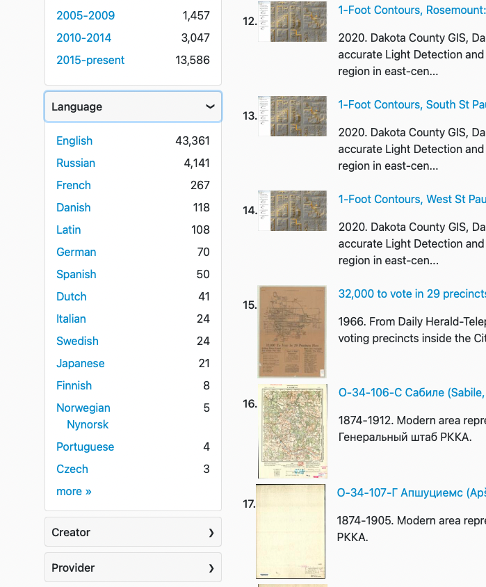
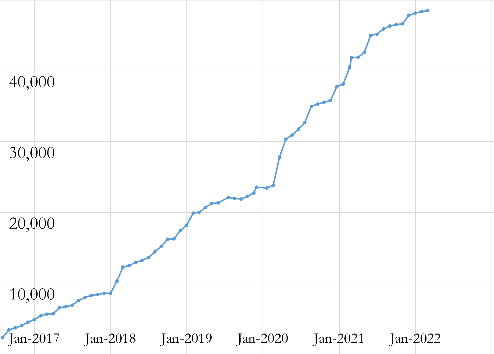

__Big Ten Academic Alliance Geospatial Information Network__

__Project Update: __  _March 2022_

__Table of Contents__

Project Highlight: Revealing each resource’s  language

Last year\, the Diverse Collections Working Group assessed the diversity of our collections using a number of different metrics\. One effort was around the topic of  __Language__ \.

Language has long been an optional field in the GeoBlacklight metadata schema\, but was not being displayed in the interface anywhere\. The Working Group recommended that the project ensure a language was assigned to each resource and to display it as a browseable facet\.

The Metadata Committee held a sprint that included attention on filling in missing language values\. The Interface Committee determined if and where to place the facet\. Finally\, the Project Manager worked with the Application Developer to implement this change\. Since the Language field uses a nonliteral 3\-letter code\, we added a translation file to derive a plain text value that is displayed in the facet\.

Although the vast majority of the resources are in English\, this facet reveals the maps that are not\. More than one project team member commented that using the facet brings a sense of fun to the discovery process\.

Statistics: Item Records

Total Item Records

__48\,500__

March 2022 actions

__New records \(681\)__

__Retired \(542\)__

Statistics: Geoportal & Blog Users

__Geoportal and Project Site users for the months of March \(2018\-2022\)__

Statistics: Top Pages

| Top Viewed Parent Pages | Top Viewed Item Pages | Top Downloaded Items (404 total) |
| :-: | :-: | :-: |
| Wisconsin Historic Aerial Imagery Finder (Aerial Photos 1937-41) (332) Sanborn Maps: Pennsylvania, 1884-1938 (126) Digital Sanborn Maps (Black & White): All States, 1867-1970 (90) | Current Tax Sale List: City of Baltimore, Maryland (232) Aerial Photography [Milwaukee County, Wisconsin] {1937} (84) Research Guide to Restricted or Licensed Data (75) Digital Sanborn Maps (Black & White):  California (74) Michigan (71) New Jersey (69) | Historic County Boundaries and Total Population: United States, 1860 (22) Indiana Roads from INDOT and TIGER Files (17) +  LiDAR 2015 - DEM 6ft: Allegheny County/Pittsburgh, Pennsylvania (15) +  |

__\+__  __ __ New to top pages

Tech Roadmap: Q2 2022

Recently Completed

__Upgraded GeoBlacklight Version 4\.0 Release Candidate 1__

__Fixed performance bug \- now running quickly__

__Implemented enhancements requested from committees\- new Language facet\, improved Citation widget\, synonym search bug__

To Do

Enable multiple downloads

Integrate administrative Rake tools \(Broken link reports\, thumbnail harvests\) into GEOMG

__Incorporate asset storage \(XML files\, thumbnails\) into GEOMG__

Activities: Committees

__Metadata Committee__

__Developing a plan to normalize the Creator value in metadata__

__Gathering resources on how to cite maps__

__Planning to look at facets next__

__Collection Development \(CD\) & __  __Education__  __ Outreach \(EO\) Committee__

__Two subprojects to be discussed at April meeting: 1\) Cross\-checking important farmlands spreadsheets \(and gathering other help guide info about this series\)\, 2\) Gathering feedback from colleagues about Global Census Archive\.__

__Planning an early Summer sprint for identifying new collections__

__Reviewing/revising collection development policy__

__Communications Committee__

__Renewing the invitation for student workers to help migrate blog posts__

__Devising a Twitter schedule of themed content__

__Interface Committee__

__Planning for a June sprint that looks at accessibility__

__Collections & Education joined the March meeting __

Activities: Working Groups

__Land Acknowledgement Working Group__

Divided and read chapters from  _[Digital Mapping and Indigenous America](https://www.taylorfrancis.com/books/edit/10.4324/9780429295546/digital-mapping-indigenous-america-janet-berry-hess)_

Will be making a list of data/map resources mentioned and concepts to follow\-up on

Reading critiques and guides to land acknowledgements

__April__

__Start ingesting Important Farmland maps\, a new collection goal__

__Publish and host sample web services to use for GeoBlacklight/Geoportal testing__

__May__

__Blog post sprint__
