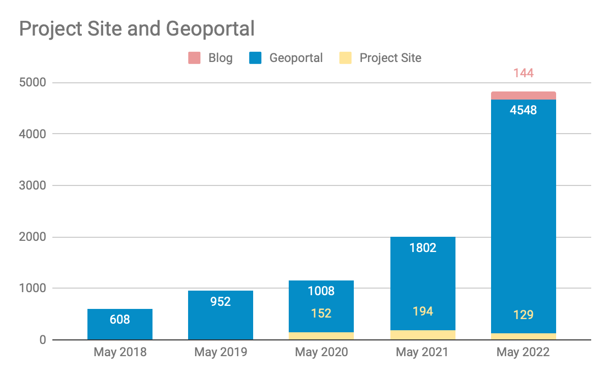

__Big Ten Academic Alliance Geospatial Information Network__

__Project Update: __  _May 2022_

__Table of Contents__

Project Highlight: Mapping Chicagoland

Cecilia Smith\, our program team member from the University of Chicago\, led a team that received a successful  __$348\,930 __ National Endowment for the Humanities \(NEH\) grant in April for the proposal “ __Mapping Chicagoland__ \.” The project is a partnership between the University of Chicago Library\, the Chicago History Museum\, and Newberry Library to digitize historical maps of Chicago through 1940\. In addition to the  _[UChicago Library website](https://www.lib.uchicago.edu/)_  and  _[Chicago Collections Consortium](https://chicagocollections.org/)_ \, the BTAA Geoportal was cited in the grant as one of the platforms where the maps will be made available\. The collaboration will involve scanning\, adding spatial data\, creating metadata\, and sharing 4\,101 digitized maps in the Fall of 2024\.

Read more about this exciting new development:

_[NEH awards UChicago Library grant to digitize Chicagoland’s historical maps](https://www.lib.uchicago.edu/about/news/neh-awards-uchicago-library-grant-to-digitize-chicagolands-historical-maps/)_

_[NEH grant will support UChicago’s partnership with Newberry Library\, Chicago History Museum](https://news.uchicago.edu/story/uchicago-library-neh-grant-digitize-chicagoland-historical-maps-newberry-chicago-history-museum)_

_[CHM tapped to partner on NEH grant to digitize Chicagoland’s historical maps](https://www.chicagohistory.org/release/chm-tapped-for-neh-grant/)_

Statistics: Item Records

* Total Item Records
* __49\,255__
* May 2022 actions
* New records \(679\)
  * __American Panorama \(537\)__
  * __Natural Resources Research Institute \(106\)__
  * __Michigan State University Maps  \(36\)__
* Retired \(2\)

Statistics: Geoportal & Blog Users

__Geoportal and Project Site users for the months of May \(2018\-2022\)__

Statistics: Geoportal User Acquisition May 2022

__How users found the site__

google\.com \(82%\)

direct link \(9%\)

bing\.com \(3%\)

datasetsearch\.research\.google\.com \(1%\)

duckduckgo\.com \(1%\)

yahoo\.com \(1%\)

__Less than 1% of traffic:__

__geoblacklight\.org__

__guides\.libraries\.psu\.edu__

__sites\.google\.com__

__geography\.wisc\.edu__

__guides\.nyu\.edu__

__info\.com__

__libguides\.lib\.msu\.edu__

__libguides\.umn\.edu__

__twitter\.com__

Top 10 search engine queries

sanborn maps \(26\)

btaa geoportal \(18\)

baltimore tax sale 2022 property list \(17\)

wisconsin historical aerial photos \(12\)

franklin county ohio school district map \(8\)

franklin county school district map \(8\)

baltimore city tax sale 2022 property list \(7\)

baltimore city tax sale list \(7\)

historical aerial photos wisconsin \(7\)

gun offender registry baltimore \(6\)

Statistics: Top Pages

| Top Viewed Parent Pages | Top Viewed Item Pages | Top Downloaded Items (254 total) |
| :-: | :-: | :-: |
| Wisconsin Historic Aerial Imagery Finder (Aerial Photos 1937-41) (313) Digital Sanborn Maps (Black & White): All States, 1867-1970 (157) | Current Tax Sale List: City of Baltimore, Maryland (147) Research Guide to Restricted or Licensed Data (80) Remonumented Section Corners: Michigan (71) Digital Sanborn Maps (Black & White):  Illinois (70) California (69) New York (69) New Jersey (66) | Remonumented Section Corners: Michigan (13) Road Centerline: Licking County, Ohio, 2020 (7) +  City Boundaries [Iowa] (6) + Topography 01: Lorain County, Ohio (6) +  Historic County Boundaries and Total Population: United States, 1860 (6)  |

__\+__  __ __ New to top pages

Tech Roadmap: Q2 2022

Recently Completed

__Enabled multiple downloads per item__

__Added GEOMG facet for Date Created \(first uploaded\)__

__Added additional time period buckets to Geoportal to reflect items before 1500 and after 2020__

__fixed Javascript bugs occurring in Safari browsers__

To Do

Add “recently added items” button to Geoportal

Add new metadata field: notes for end user

Activities: Committees

__Metadata Committee__

__Investigating synonyms and stemming options in Solr to improve search results__

__Analyzing usefulness of Resource Type field and facet__

__Collection Development \(CD\) & __  __Education__  __ Outreach \(EO\) Committee__

__Met with Communications to discuss DEIA goal\-setting opportunities around rural areas__

__Held first Mappy Hour with 8 Team members__

__EO to look at ESRI StoryMaps platform issues next__

__Communications Committee__

__Exploring DEIA goal of focusing on rural America __  __rural communities as an underserved population__

__Interface Committee__

__Planning for June Interface sprint__

Activities: Working Groups

__Land Acknowledgement Working Group__

__Working on an “__  _[Action plan](https://docs.google.com/document/d/1FYlpb4k1OBJ9-t8H4hoeDW9hSgFHRk-o1FzKWp2wovo/edit#heading=h.gu0tzrmbe2sg)_  __” using the guide __  _[Beyond Land Acknowledgements](https://nativegov.org/resources/beyond-land-acknowledgment-a-guide/)_

__Creator Standardization Working Group__

__Exploring techniques for batch normalization\, such as __  __FAST API \(OCLC product\) \+ Open Refine__

__June__

__Interface sprint__

__Sunset the Land Acknowledgement Working Group__

__July__

__Onboard Rutgers University to the Team__

__Collections sprint__

__Kickoff a Website Content Working Group__
