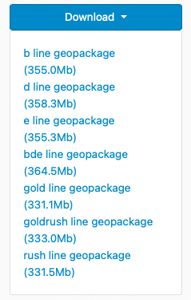
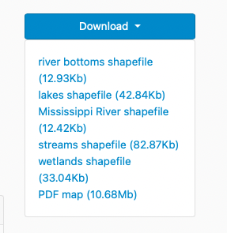
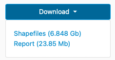
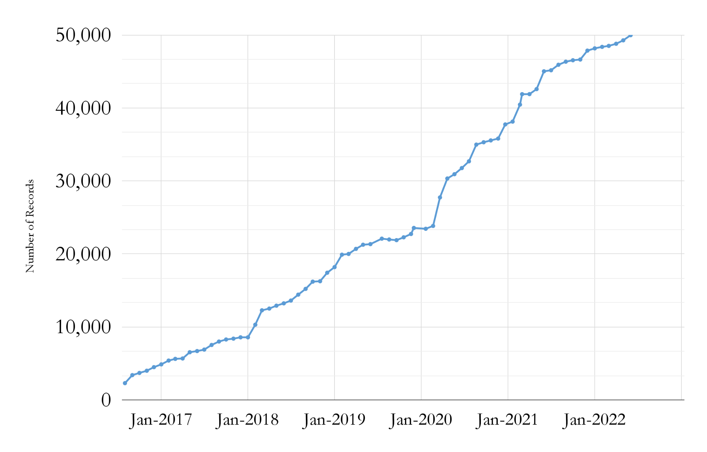

__Big Ten Academic Alliance Geospatial Information Network__

__Project Update: __  _June 2022_

__Table of Contents__

Project Highlight: Multiple Downloads

We were recently able to incorporate a long\-standing feature request into the BTAA Geoportal interface:  __multiple downloads per item__ \.  When GeoBlacklight was originally created\, each item page was intended to correspond to a single web service with a single download\. Over time\, the application has become more flexible and item pages can represent complex resources\. However\, without having the option of presenting multiple downloads\, we always needed to send users back to the original site to access the files\.

With the new functionality\, we  __are able to add multiple downloads per page and attach custom labels that clarify the content and indicate file sizes\.__

This new feature has been especially useful when adding  __research data__ \, which often includes multiple\, but related files\.

Examples of new multiple downloads in the Geoportal

Statistics: Item Records

* Total Item Records
* __49\,963__
* June 2022 actions
* New records \(711\)
* notable new additions:
  * _[OHU Map Library](https://geo.btaa.org/catalog?f%5Bdct_isPartOf_sm%5D%5B%5D=11d-02)_  \(28\)
  * _[NJ Open Data](https://geo.btaa.org/catalog/14a-01)_  \(480\)
  * _[UMN Conservancy ](https://geo.btaa.org/?page=1&q=%222022-06-23%22&search_field=all_fields)_ \(11\)
* Retired \(7\)

Statistics: Geoportal & Blog Users

__Geoportal and Project Site users for the months of June \(2018\-2022\)__

Statistics: Geoportal User Acquisition June 2022

__How users found the site__

google \(82\.0%\)

\(direct\) \(8\.1%\)

bing \(4\.0%\)

datasetsearch\.research\.google\.com \(1\.3%\)

duckduckgo\.com \(1\.0%\)

yahoo \(0\.9%\)

geoblacklight\.org \(0\.2%\)

guides\.libraries\.psu\.edu \(0\.2%\)

guides\.nyu\.edu \(0\.2%\)

libguides\.lib\.msu\.edu \(0\.2%\)

Top 10 search engine queries

btaa geoportal \(28\)

sanborn maps \(23\)

baltimore city tax sale list \(12\)

sanborn maps new jersey \(9\)

wisconsin aerial photography catalog \(8\)

outagamie county gis \(7\)

power outages by zip code today \(7\)

sanborn maps pennsylvania \(7\)

wisconsin 1937 aerial imagery \(7\)

detroit sanborn maps \(6\)

Statistics: Top Pages

| Top Viewed Parent Pages | Top Viewed Item Pages | Top Downloaded Items (231 total) |
| :-: | :-: | :-: |
| Wisconsin Historic Aerial Imagery Finder (Aerial Photos 1937-41) (270) Digital Sanborn Maps (Black & White): All States, 1867-1970 (177) Fire Insurance Maps Online (67) | Research Guide to Restricted or Licensed Data (92) Maryland Power Outages - by ZIP Code: State of Maryland (71) +  Current Tax Sale List: City of Baltimore, Maryland (58) Digital Sanborn Maps (Black & White):  New York (140) Michigan (81) | Indiana Roads from INDOT and TIGER Files: Indiana (20) + Urgent Care Facilities: SEMCOG, Southeast Michigan Council of Governments (8) + Historic County Boundaries and Total Population: United States, 1960 (8) City Boundaries [Iowa] (7) + Contour Lines: Milwaukee County GIS and Land Information (6) + |

__\+__  __ __ New to top pages

Tech Roadmap: Q3 2022

Recently Completed

__Added life cycle tracking in metadata editor \(GEOMG\) to help find when things were first created and last updated__

__fixed more Javascript bugs occurring in Safari browsers__

__Produced a __  _[new release for GeoBlacklight](https://github.com/geoblacklight/geoblacklight/releases/tag/v4.0.0-rc2)_  __ that fixes several bugs__

To Do

Adjust color scheme for contrast accessibility

Incorporate multiple or complex geometries

participate in GeoBlacklight summer sprint

Activities: Committees

__Metadata Committee__

__Discussed how to normalize the Resource Type facet__

__Working on DEIA goal wording to be finalized at July meeting__

__Collection Development \(CD\) & __  __Education__  __ Outreach \(EO\) Committee__

__Prepping for collections sprint coming up on July 15th on the topic of __  _[Rural Areas as an Underserved Population](https://docs.google.com/document/d/1foUtcNjWvwPcPYKLIRtf8HuP1GiIIRD9oJxpiZj0m4I/edit)_

__Finalizing DEIA goals including implementing parts of the Land Acknowledgement Working Group action plan__

__Communications Committee__

__Did not meet in June__

__Next topics: blog/tweet schedule; finalizing DEIA goals__

__Interface Committee__

_[Summarized recent sprint findings](https://docs.google.com/spreadsheets/d/18k50-LAz7eco-9o3MhnUetOWxnD8KwKUDMewb4ClG18/edit?usp=sharing)_

__Investigating best practices for in\-site user surveys__

__Finalized DEIA goal \- accessibility__

Activities: Working Groups

* __Land Acknowledgement Working Group__
* __Final documents submitted for review and approval:__
  * _[Action Plan](https://docs.google.com/document/d/1ZD2qj5Vvjoxj_4EBFgE98CDOkNXh5Or1lBCroJ5idHo/edit#)_  __ __
  * _[Final Report](https://docs.google.com/document/d/1_vQjd__JmvYH-6FNNmFkhqNWjUqXUqcBu7a8B-W9FEQ/edit?usp=sharing)_  __ __
* __Creator Standardization Working Group__
* __Presented to Metadata Committee on strategy for batch cleanup of Creator field__
* __Began working on Best Practices for creator standardization report__
* __Original Content Working Group__
* _[Charge sent out](https://docs.google.com/document/d/14-U3iA3_uOxbhiMHVcden0XDyMaB37muq019JO2q7KU/edit?usp=sharing)_
* __Set up OSF account: __ [osf\.io/wn32s](https://osf.io/wn32s/)

__July__

__Sunset the Land Acknowledgement Working Group__

__Incorporate resources from Rutgers University__

__Collections sprint__

__Kickoff a Website Content Working Group__

__Kickoff the GIS Conference Planning Group__
