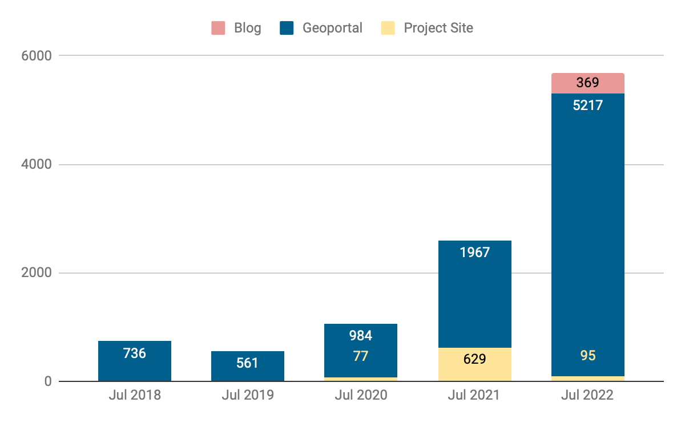
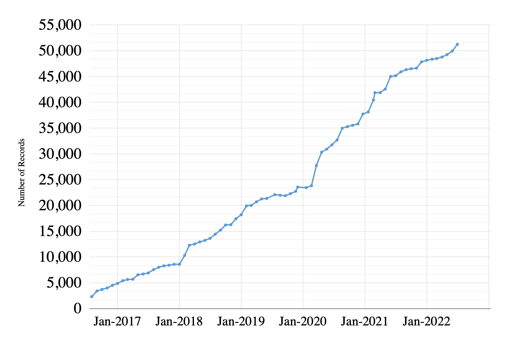

# Big Ten Academic Alliance 
Geospatial Information Network

# Status Report
July 2022

# Table of Contents

# Highlight
Statistics
Operations
Community
What’s Next?

# Highlight: Welcome Rutgers University

Rutgers University officially joined the BTAA\-GIN in July 2022\. This brings our our number of institution partners to 14\, and our map now includes New Jersey\.

Welcome to our new Team Members Susan Oldenburg \(Research Support/GIS Specialist\) and Francesca Giannetti \(Digital Humanities Librarian\)\.

# Statistics: Site Traffic

Month of July Views of Blog\, Geoportal\, & Project Site \(2018\-2022\)

__How users found the site__

__Google \(76%\)__

__direct link \(9%\)__

_spambot_  __ \[now blocked\] \(5\.5%\)__

__bing \(3\.5%\)__

__duckduckgo \(1%\)__

__yahoo \(1%\)__

__datasetsearch\.research\.google\.com \(>1%\)__

__guides\.libraries\.psu\.edu \(>1%\)__

__geoblacklight\.org \(>1%\)__

__Top search engine queries__

__sanborn maps__

__btaa geoportal__

__power outage \+ by zip code / maryland / today__

__baltimore county permits__

__sanborn maps nyc__

__historical aerial photos wisconsin__

# Statistics: Top Visited Pages

| PARENT PAGES | ITEM PAGES | DOWNLOADS |
| :-: | :-: | :-: |
| Wisconsin Historic Aerial Imagery Finder (Aerial Photos 1937-41) (307) | Maryland Power Outages - by ZIP Code: State of Maryland (504) | Historic County Boundaries and Total Population: United States, 1940 (11) |
| Digital Sanborn Maps (Black & White): All States, 1867-1970 (216) | Digital Sanborn Maps (Black & White) NY (158)     CA (122)     MI (98)     NJ (86) | Roads from INDOT and TIGER Files: Indiana (10) |
| General Land Office Township Plats: Michigan (58) | Research Guide to Restricted or Licensed Data (94) | Remonumented Section Corners: Michigan (9) |
|  | Property Data - Tax Map Grids: Maryland (60) | Southwest Anvers Island and Palmer Basin: ASMA No. 7: Antarctica (8) + |
|  | Remonumented Section Corners: Michigan (60) |  new to top pages + |
|  | School District Boundaries: Franklin County, Ohio (54) |  |

# Operations: Collections

Number of BTAA Geoportal records over time \(2017\-present\)

Total Item Records:  __51\,260__

New records:  __3646__

_[Wisconsin state and county data](https://geo.btaa.org/?f%5Bdct_spatial_sm%5D%5B%5D=Wisconsin&f%5Bschema_provider_s%5D%5B%5D=UW-Madison+Robinson+Map+Library&page=1&q=2022-07-27&search_field=all_fields)_  \(553\)

ArcGIS Hubs \(3088\)

Retired records:  __2479\*__

\*Most ArcGIS Hubs began using a different identifier for their items this summer\. This registers as a “new” record for us\.

# Operations: Application Development

__P__  __rimary milestones__

__added dashboard queries for GEOMG__

__upgraded to Ruby 3__

__Geoportal migrated to AWS servers__

__enabled __  __multiple__  __ downloads per item__

__implemented new color scheme for accessibility__

__enabled multiple bounding boxes per item__

_[GeoBlacklight Sprint](https://geoblacklight.org/blog/%7C/sprint/2022/08/01/summer-sprint-2022-announcement.html)_

__Release official version 4__

_[GeoBlacklight Sprint](https://geoblacklight.org/blog/%7C/sprint/2022/03/07/winter-sprint-recap.html)_

__upgraded to GeoBlacklight’s__

__v\.4 release candidate__

__fixed slow speed issue__

__improved lifecycle tracking in GEOMG__

_[GeoBlacklight Sprint](https://geoblacklight.org/blog/%7C/sprint/2022/08/01/summer-sprint-2022-announcement.html)_

__update GeoBlacklight documentation__

# Community: Committees

Steering: developing DEIA goal

CDEO: assessing resources gathered during July sprint; working on Critical Cartography reading list

Communications: finalized DEIA goal \(highlight resources related to underserved populations\)\, reassessing mission

Interface: discussing how to improve Geoportal accessibility\, considering pop\-up survey

Metadata: finalized DEIA goal \(reparative\, inclusive description practices\)

# Community: Working Groups

Land Acknowledgement: submitted final deliverables and ready to sunset

Creator Standardization: collaborating asynchronously on “Best Practices for Inputting Creator Field Data” document

Conference Planning: held kickoff meeting\, divvied up responsibilities\, selected conference date

Original Content: issued charge and plan to kickoff in August

# What’s Next?

August

hire graduate Research Assistant for metadata processing

GeoBlacklight Community Sprint: Summer 2022\, Iteration 1

September

Issue call for proposals for the BTAA GIS Conference

GeoBlacklight Community Sprint: Summer 2022\,  Iteration 2

# Appendix: Business Model Canvas for the BTAA-GIN

__Key Activities__

__Value Propositions__

__Customer Relationships__

__Customer Segments__

digital curation

collective geospatial infrastructure

instructors & students

Big Ten Academic Alliance

software development

guides & tutorials

geospatial resources are easier to find

outreach & service

__Key Resources__

librarians & specialists are more connected

diversity of expertise

blog / social media

leadership for the geospatial community

economy of scale

__Revenue Streams__

partner contributions

technology hosting
