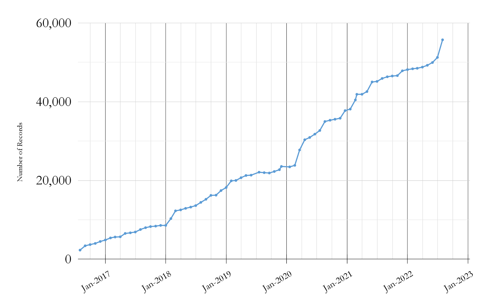

# Big Ten Academic Alliance 
Geospatial Information Network

# Status Report
August 2022

# Table of Contents

# Highlight
Statistics
Operations
Community
What’s Next?

# Highlight: Action Plan

The Land Acknowledgement Working Group sunsetted in August after submitting their  _[final report](https://docs.google.com/document/d/e/2PACX-1vTenGnM0Ps9-VzeeJ0rTfx23mrppsiKKhrdbZwRQd9PzaxDV15oe5PY-SH0-IUQUHepNDf-YVpr8Mty/pub)_  along with an  _[Action Plan](https://drive.google.com/file/d/10M2GBPV3P18W9Bo-MoflNNxBnyDS3AOU/view)_ \.

The Action Plan contains three sections: an acknowledgement Statement\, Commitments to Action\, and Resources\. This work has been passed to the Steering Committee\, who are evaluating the next steps\.

_image of first page of the _  _[Action](https://drive.google.com/file/d/10M2GBPV3P18W9Bo-MoflNNxBnyDS3AOU/view)_  _[ Plan](https://drive.google.com/file/d/10M2GBPV3P18W9Bo-MoflNNxBnyDS3AOU/view)_

# Statistics: Site Traffic

__Top Cities__

__Ashburn	795 \(12\.54%\) __ \(AWS bot\, blocked now\)

__\(not set\)	701 \(11\.06%\)__

__New York	189 \(2\.98%\)__

__Chicago	156 \(2\.46%\)__

__Baltimore	104 \(1\.64%\)__

__Washington	101 \(1\.59%\)__

__Columbus	74 \(1\.17%\)__

__Milwaukee	64 \(1\.01%\)__

__Philadelphia	62 \(0\.98%\)__

__Minneapolis	58 \(0\.91%\)__

__Top search engine queries__

sanborn maps

btaa geoportal

power outage by zip code

wisconsin historical aerial photos

franklin county school district map

dearborn ohio

Month of July Views of Blog\, Geoportal\, & Project Site \(2018\-2022\)

# Statistics: Top Visited Pages

| PARENT PAGES | ITEM PAGES | DOWNLOADS |
| :-: | :-: | :-: |
| Wisconsin Historic Aerial Imagery Finder (Aerial Photos 1937-41) (275) | Maryland Power Outages - by ZIP Code: State of Maryland (196) | Roads from INDOT and TIGER Files: Indiana (18)  |
| Digital Sanborn Maps (Black & White): All States, 1867-1970 (265) | Digital Sanborn Maps (Black & White) NY (178)     CA (148)     MA (96)  | Quaternary Geologic Map : Indiana (13) + |
| Sanborn Maps: Pennsylvania, 1884-1938 (104) | Research Guide to Restricted or Licensed Data (83) |  Historic County Boundaries and Total Population: United States, 1910 (10) |
| Fire Insurance Maps Online (FIMo): All States - Big Ten Academic Alliance Geoportal (87) | Urban Rural Demarcation Line: Baltimore County, Maryland (68) + | Remonumented Section Corners: Michigan (9) |
|  | School District Boundaries: Franklin County, Ohio (66) |  new to top pages + |
|  |  |  |

# Operations: Collections

Number of BTAA Geoportal records over time \(2017\-present\)

Total Item Records:  __55\,732__

New records:  __4\,761__

Rutgers Maps of New Jersey \(4579\)

ArcGIS Hubs \(138\)

_[Wisconsin LiDAR](https://geo.btaa.org/?f%5Bschema_provider_s%5D%5B%5D=WisconsinView&q=2022-08-05&search_field=all_fields)_  \(34\)

Retired records:  __299__

# Operations: Application Development

__P__  __rimary milestones 2022__

__added dashboard queries for GEOMG__

__upgraded to Ruby 3__

__Geoportal migrated to AWS servers__

__enabled __  __multiple__  __ downloads per item__

__implemented new color scheme for __  __accessibility__

__enabled multiple bounding boxes per item__

_[GeoBlacklight Sprint](https://geoblacklight.org/blog/%7C/sprint/2022/08/01/summer-sprint-2022-announcement.html)_

__Release official version 4__

__GEOMG development__

_[GeoBlacklight Sprint](https://geoblacklight.org/blog/%7C/sprint/2022/03/07/winter-sprint-recap.html)_

__multiple geometries__

__accessibility improvements__

__upgraded to GeoBlacklight’s__

__v\.4 release candidate__

__fixed slow speed issue__

__improved lifecycle tracking in GEOMG__

_[GeoBlacklight Sprint](https://geoblacklight.org/blog/%7C/sprint/2022/08/01/summer-sprint-2022-announcement.html)_

__updated GeoBlacklight documentation__

__GEOMG development__

__GEOMG released for adoption__

# Community: Committees

Steering: Convening a short\-term Future Directions Working Group

CDEO: Continuing review of datasets and sources from  _[rural areas sprint](https://docs.google.com/spreadsheets/d/1qBL6RSnF5wTh1hJmhVrMaviwkFFKfYtlrA_H5hrRfWg/edit#gid=0)_ \, updating Critical Cartography list of resources\, planning new tutorials

Communications: Changing name to “Community Engagement”\, exploring merging with another committee

Interface: Reviewing work of  _[Library Accessibility Alliance](https://www.libraryaccessibility.org/testing)_ \, investigating tooltips and collection spotlights in the Geoportal

Metadata: Planning metadata cleanup sprint on September 30

# Community: Working Groups

Creator Standardization: collaborating asynchronously on “Best Practices for Inputting Creator Field Data” document

Conference Planning: secured keynote speakers\, ready to distribute announcements

Original Content: held kickoff meeting; identified content to address; researching solutions

# What’s Next?

September

Issue call for proposals for the BTAA GIS Conference

GeoBlacklight Community Sprint: Summer 2022\,  Iteration 2

November

Host BTAA GIS Conference
