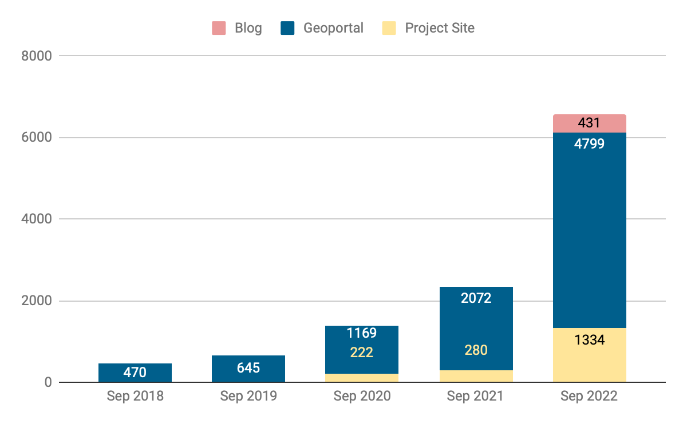
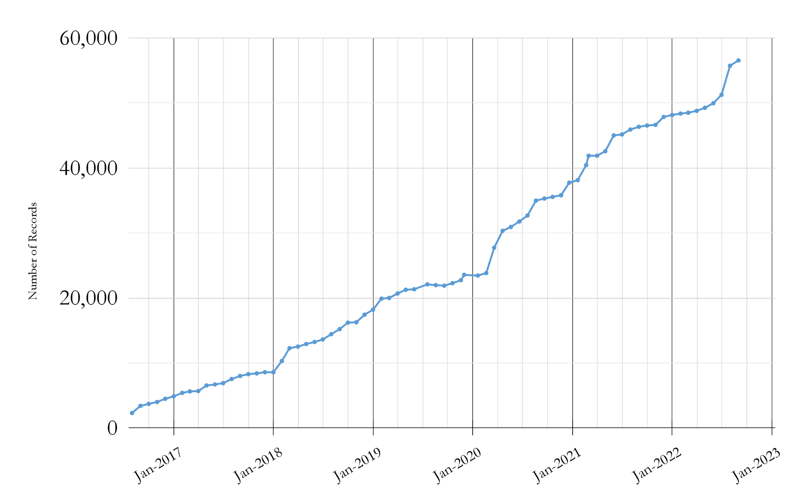

# Big Ten Academic Alliance 
Geospatial Information Network

# Status Report
September 2022

# Table of Contents

# Highlight
Statistics
Operations
Community
What’s Next?

# Highlight: GeoBlacklight version 4.0

During the September GeoBlacklight \(GBL\) Community Sprint\, we released  _[GeoBlacklight version 4\.0](https://github.com/geoblacklight/geoblacklight/releases/tag/v4.0.0)_ \. This version provides full support for the  _[OpenGeoMetadata ‘Aardvark’ metadata schema](https://opengeometadata.org/docs/ogm-aardvark)_  and represents concerted efforts from many in the GBL community \-  _[Read more about the release here\.](https://geoblacklight.org/blog/%7C/sprint/2022/09/20/geoblacklight-4.html)_

__Over the past few years\, the BTAA\-GIN has provided the primary leadership and momentum for the GBL community\. We can attribute this to at least two aspects of the BTAA\-GIN’s structure and goals:__

__We have two Operations Team employees designated to work on the Geoportal as their sole or primary activity: an on\-staff Product Manager @ 1\.0 FTE and an independent Application Developer\, who works a focused weeklong sprint every month\. This allocation differs from__  __ __  __institutions with staff responsible for a myriad of applications\.__

__We value collaboration and open documentation\, which allows us to focus on contributions to the broader geospatial library community\. This emphasis is distinct from many individual academic institutions that are mandated to focus exclusively on their own application ecosystem\.__

# Statistics: Site Traffic

__How users found the site__

_    Main channels_

__Google \(83%\)__

__direct link \(7%\)__

__B__  __ing \(3%\)__

__datasetsearch\.research\.google\.com \(1%\)__

_     Less than 1% \(~ a few dozen people each\)_

__Yahoo__

__DuckDuckGo__

__guides\.libraries\.psu\.edu__

__geoblacklight\.org__

__libguides\.umn\.edu__

__geography\.wisc\.edu__

Month of September Users of Blog\, Geoportal\, & Project Site \(2018\-2022\)

# Statistics: Top Visited Pages

| PARENT PAGES | ITEM PAGES | DOWNLOADS |
| :-: | :-: | :-: |
| Wisconsin Historic Aerial Imagery Finder (Aerial Photos 1937-41) (273) | Maryland Power Outages - by ZIP Code: State of Maryland (110) | Roads from INDOT and TIGER Files: Indiana (24) |
| Digital Sanborn Maps (Black & White): All States, 1867-1970 (273) | Digital Sanborn Maps (Black & White) NY (176)     CA (124)     MI (118)  | Address Grid: Geauga County, Ohio (14) + |
| Sanborn Maps: Pennsylvania, 1884-1938 (147) | Research Guide to Restricted or Licensed Data (83) | Address Centerline Points: Geauga County, Ohio (8)  + |
| Fire Insurance Maps Online (FIMo): All States - Big Ten Academic Alliance Geoportal (73) | Urban Rural Demarcation Line: Baltimore County, Maryland (67) | Historic County Boundaries and Total Population: United States, 1940 (8); 1880 (7) |
|  | Property Data: Tax Map Grids: Maryland (63) | City Boundaries [Iowa] (6)   |
|  |  |  new to top pages +  |

# Operations: Collections

Number of BTAA Geoportal records over time \(2017\-present\)

Total Item Records:  __56\,548__

New records:  __736__

_[UMN UMedia Borchert Maps](https://geo.btaa.org/catalog?f%5Bdct_isPartOf_sm%5D%5B%5D=05d-01)_  \(493\)

_[ArcGIS Hubs](https://geo.btaa.org/?search_field=all_fields&q=%222022-09-16%22+arcgis)_  \(129\)

_[CKAN Hubs](https://geo.btaa.org/?search_field=all_fields&q=%222022-09-22%22+ckan)_  \(8\)

_[Geology Library and Map Room: The Ohio State University](https://geo.btaa.org/?f%5Bdct_isPartOf_sm%5D%5B%5D=11d-02&search_field=all_fields&q=%222022-09-28%22)_  \(103\)

# Operations: Application Development

__P__  __rimary milestones 2022__

__added dashboard queries for GEOMG__

__upgraded to Ruby 3__

__Geoportal migrated to AWS servers__

__enabled __  __multiple__  __ downloads per item__

__implemented new color scheme for __  __accessibility__

__enabled multiple bounding boxes per item__

_[GeoBlacklight Sprint](https://geoblacklight.org/blog/%7C/sprint/2022/09/20/geoblacklight-4.html)_

__released official version 4__

__GEOMG development__

_[GeoBlacklight Sprint](https://geoblacklight.org/blog/%7C/sprint/2022/03/07/winter-sprint-recap.html)_

__multiple geometries__

__accessibility improvements__

__upgraded to GeoBlacklight’s__

__v\.4 release candidate__

__fixed slow speed issue__

__improved lifecycle tracking in GEOMG__

_[GeoBlacklight Sprint](https://geoblacklight.org/blog/%7C/sprint/2022/08/01/summer-sprint-2022-announcement.html)_

__updated GeoBlacklight documentation__

__GEOMG development__

__GEOMG released for adoption__

# Community: Committees

Steering

Held a Future Directions meeting to discuss ideas for the BTAA\-GIN

Interface

Looking into accessibility testing

developing questions for a popup survey

Metadata: Held a metadata sprint that resulted in:

Improved bounding box coordinates for 3681 scanned maps \(about 80% of the new additions\)

Added missing values to the language field

Metadata changes to another 800\+ maps

# Community: Working Groups

Creator Standardization:

Implemented workflow at the metadata sprint and investigated ~100 Creator names

Matched 42 that were missed by the automated process

Added 31 names to FAS

Conference Planning:

Worked with BTAA to set up registration

Distributed calls for proposals and registration links

Original Content:

Evaluated existing Tutorial slides for accessibility

Investigating alternative platforms and formats for tutorials

# What’s Next?

October

Local development sprint to work on the GEOMG Metadata Toolkit in anticipation of releasing a public version soon

November

Host BTAA GIS Conference

Sunset Original Content Working Group and migrate tutorials
