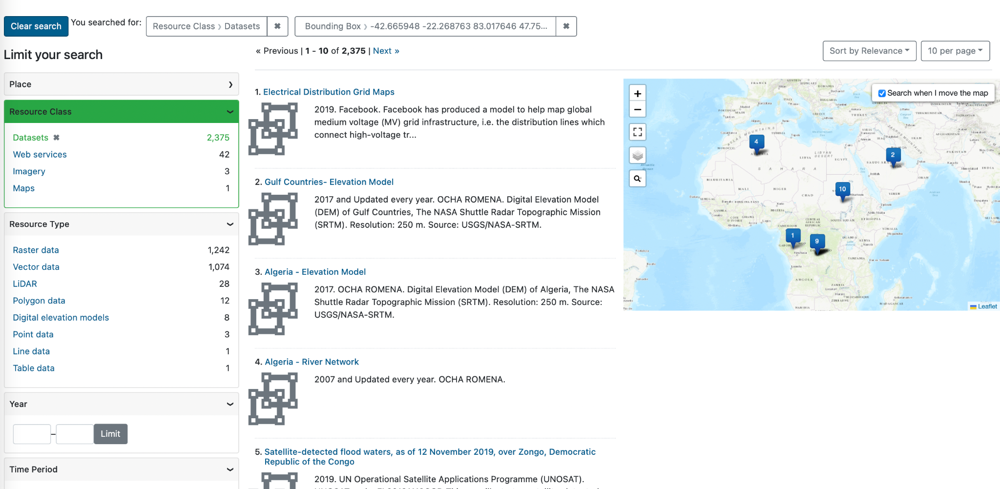
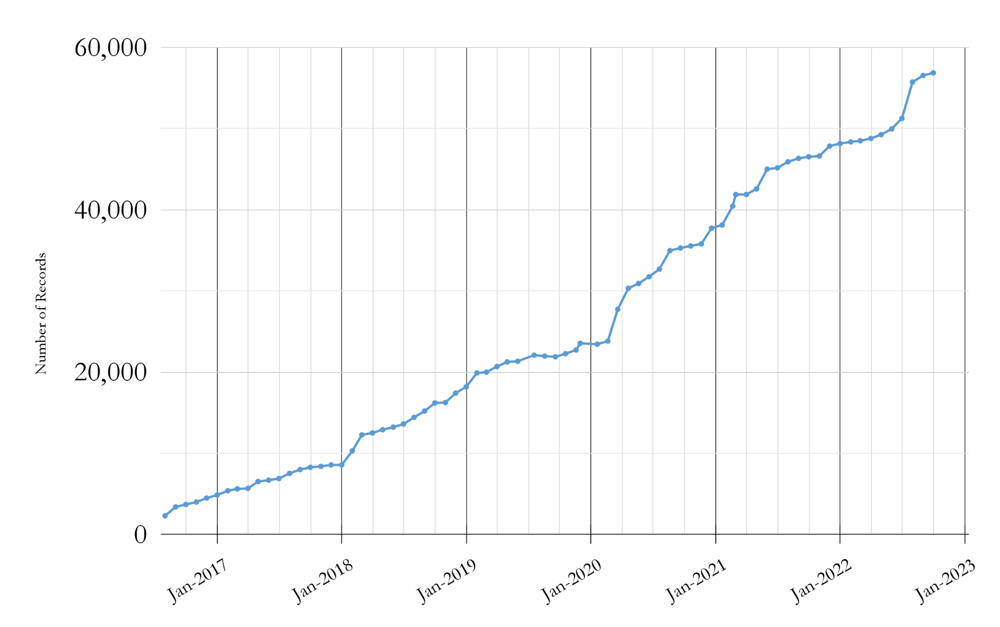

# Big Ten Academic Alliance 
Geospatial Information Network

# Status Report
October 2022

# Table of Contents

# Highlight
Statistics
Operations
Community
What’s Next?

We redesigned the search results page to emphasize the map and simplify the layout\.

# Highlight: Redesigned Search Results Page

__Problem \#1__ : The map search was somewhat hidden\, because users needed to click a toggle to turn it on\.

__Solution__ : We removed the toggle and combined the list & map search views to the same page\.

__Problem \#2__ : The map search returned up to 1000 items and displayed the results using map clusters\. This caused user confusion as this did not match the text results list\.

__Solution__ : We removed the clustering and added numbers to each markers that match the item in the result list\.

# Statistics: Site Traffic

__How users found the site__

_    Main channels_

__Google \(83%\)__

__direct link \(7%\)__

__B__  __ing \(3%\)__

__datasetsearch\.research\.google\.com \(1%\)__

_     Less than 1% \(~ a few dozen people each\)_

__DuckDuckGo__

__Yahoo__

__guides\.libraries\.psu\.edu__

__libguides\.lib\.msu\.edu__

__michaelminn\.net__

__guides\.osu\.edu__

Month of October Users of Blog\, Geoportal\, & Project Site \(2018\-2022\)

# Statistics: Top Visited Pages

| PARENT PAGES | ITEM PAGES | DOWNLOADS (492 total) |
| :-: | :-: | :-: |
| Wisconsin Historic Aerial Imagery Finder (Aerial Photos 1937-41) (306) | Remonumented Section Corners: Michigan (124) | Roads from INDOT and TIGER Files: Indiana (23) |
| Digital Sanborn Maps (Black & White): All States, 1867-1970 (274) | Digital Sanborn Maps (Black & White) NY (144)     CA (127)     MI (96)  | Historic County Boundaries and Total Population: United States, 1980 (14); 1860 (12); 1910 (12); 1920 (10); 1940 (7) |
| Sanborn Maps: Pennsylvania, 1884-1938 (74) | Research Guide to Restricted or Licensed Data (99) | City Boundaries [Iowa] (6) |
| Fire Insurance Maps Online (FIMo): All States - Big Ten Academic Alliance Geoportal (50) | Urban Rural Demarcation Line: Baltimore County, Maryland (74) | ZIP code boundaries: Baltimore, Maryland (5) |
|  | Big Game Check Stations: Nebraska (73) |   |
|  |  |  new to top pages +  |

# Operations: Collections

Number of BTAA Geoportal records over time \(2017\-present\)

Total Item Records:  __56\,868__

New records:  __355__

_[ArcGIS Hubs](https://geo.btaa.org/?search_field=all_fields&q=%222022-10-14%22)_  \(342\)

_[ERDDAP ](https://geo.btaa.org/catalog/14d-02)_ \(13\)

Retired records:  __73__

# Operations: Application Development

__P__  __rimary milestones 2022__

__added dashboard queries for GEOMG__

__upgraded to Ruby 3__

__Geoportal migrated to AWS servers__

__enabled __  __multiple__  __ downloads per item__

__implemented new color scheme for __  __accessibility__

__enabled multiple bounding boxes per item__

_[GeoBlacklight Sprint](https://geoblacklight.org/blog/%7C/sprint/2022/09/20/geoblacklight-4.html)_

__released official version 4__

__GEOMG development__

_[GeoBlacklight Sprint](https://geoblacklight.org/blog/%7C/sprint/2022/03/07/winter-sprint-recap.html)_

__multiple geometries__

__accessibility improvements__

__upgraded to GeoBlacklight’s__

__v\.4 release candidate__

__fixed slow speed issue__

__improved lifecycle tracking in GEOMG__

_[GeoBlacklight Sprint](https://geoblacklight.org/blog/%7C/sprint/2022/08/01/summer-sprint-2022-announcement.html)_

__updated GeoBlacklight documentation__

__redesigned search page layout__

__fixed map search bugs__

__GEOMG released for adoption__

# Community: Committees

Steering

Discussing future directions and DEIA goals

Community Engagement

Updated charter

Interface

Communicated with the Library Accessibility Alliance to test the Geoportal

Selected polling questions for site

Metadata & CDEO

did not meet

# Community: Working Groups

Creator Standardization:

Scheduled a working meeting in November to finish up work from September’s metadata sprint

Conference Planning:

Set agenda

Assigned facilitators to each session

Original Content:

Submitted  _[final report for review](https://docs.google.com/document/d/1cC88ioZQ28q-zsIrXjdJrFOLYAaAOA3Z0s3-Gsls3qg/edit?usp=sharing)_

# What’s Next?

November

Host BTAA GIS Conference

Sunset Original Content Working Group

December

Upgrade Tutorials for accessibility
