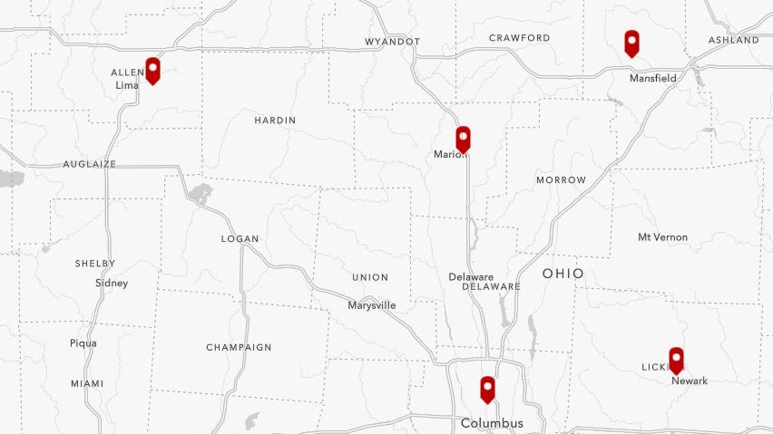
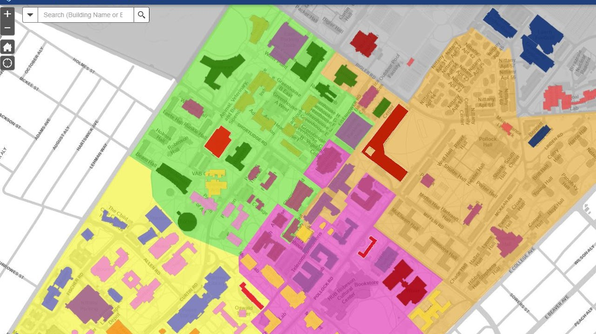
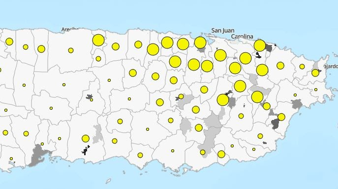
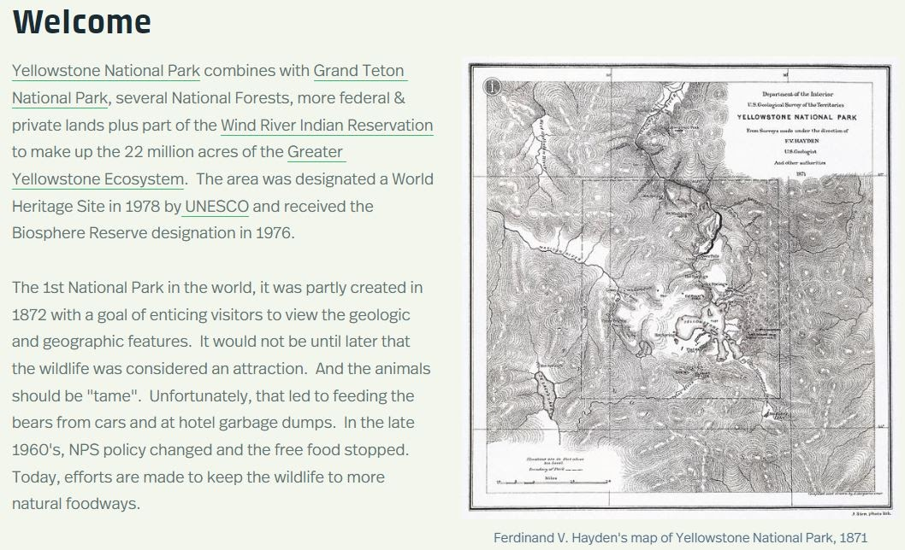
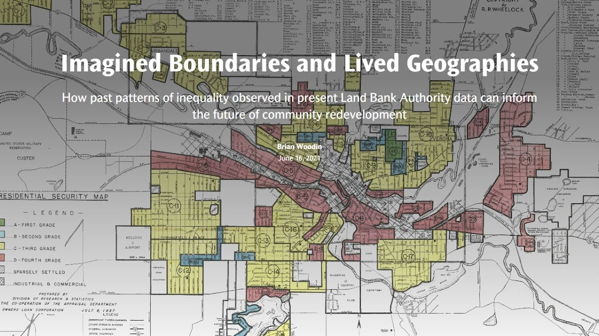
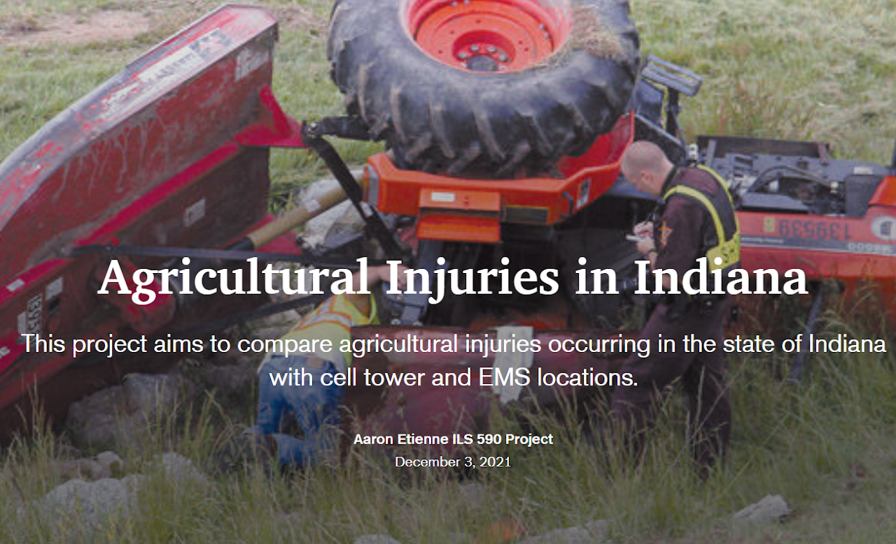
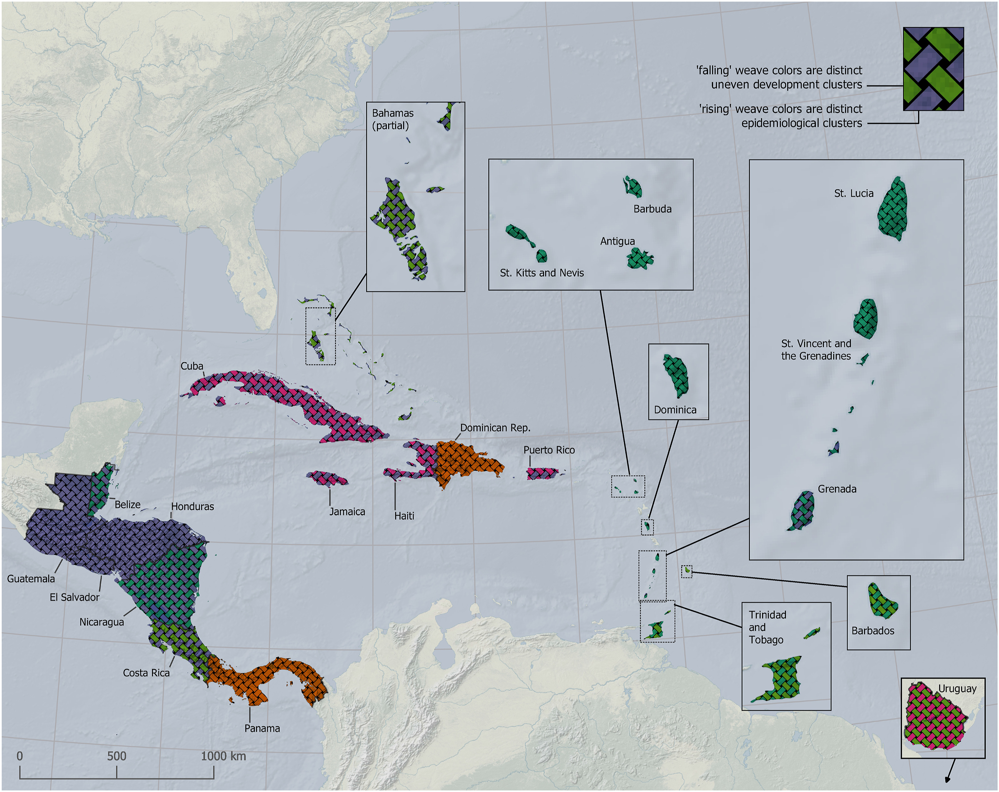
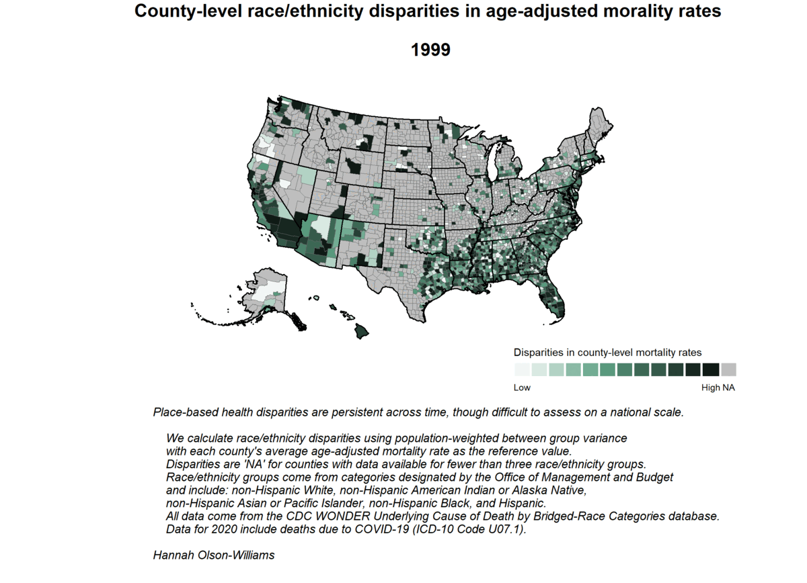
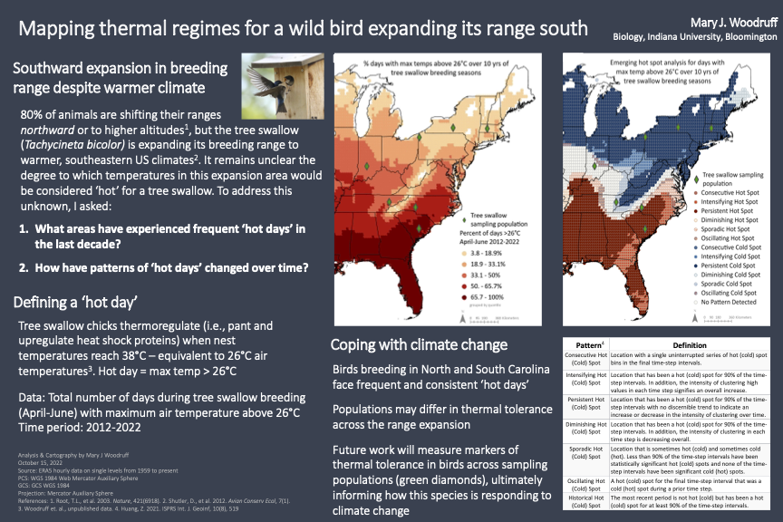

# 2022 Map Gallery

## Interactive Maps

-	### [My Math and English Story (IMME): An Illustrated Guide :octicons-link-external-24:](https://storymaps.arcgis.com/stories/ca6b1b524434433791ff6f18d041d984)

	{ align=left ; width="350" } 
 
	**Elizabeth C. Arend, The Ohio State University**

	Inspired by David Epstein's "Range: Why Generalists Triumph in a Specialized World" and Ben Orlin's "Math with Bad Drawings," Liz set out 	to create a digital guide that informs the next wave of Integrated Major in Math and English (IMME) students at The Ohio State University. 

-	### [The Geology of Yellowstone National Park :octicons-link-external-24:](https://storymaps.arcgis.com/stories/341cf2bfcbb540cf9aded42a292103e6)

	{ align=left ; width="350" } 

	**Patti Dittoe, The Ohio State University Libraries**

	This story map is intended to celebrate the sesquicentennial of park, and it gives a brief background of the formation of the land, and the 	caldera beneath it, in the introduction.  Chapter 2 is a tour of popular geothermal features; chapter 3 is about the hotspot and caldera; 	chapter 4 is a tour of popular geologic features; chapter 5 is about challenges to Yellowstone National Park, and it includes a list of links 	to library resources; the closing chapter shares that Yellowstone is also a World Heritage Site, and Biosphere Reserve.

-	### [Explore the gender pay gap in your county :octicons-link-external-24:](https://uw-mad.maps.arcgis.com/apps/dashboards/83e617cc81c1418d946fa3c1cfdb9ca9)

	{ align=left ; width="350" } 

	**Jess Hoffelder, University of Wisconsin Population Health Institute**

	On average, women in the U.S. earn little more than 80 cents for every dollar white men make. The gender pay gap is expected to persist for decades, particularly for women of color and in rural areas. For the nation’s women who work outside the home, decades of economic insecurity and pay inequity were made worse by the pandemic. The gap exists in nearly every county across the country but is at its widest in rural areas where women earn 77 cents, on average, for every dollar men make. Women also earn less than men for similar work in Southern and Western Plains states. This map allows the user to explore the gender pay gap (presented as cents on the dollar) in their county. The map pop-up classifies counties as urban or rural for additional context. This map was designed for a Data Spotlight publication on the County Health Rankings and Roadmaps website to draw connections between the gender pay gap and health (https://www.countyhealthrankings.org/reports/gender-pay-gap). When women have opportunities, such as a fair chance for education, employment, and earnings, they are more likely to live longer and healthier lives and their children are also more likely to fare better. 

-	### [University Operations  :octicons-link-external-24:](https://psu-opp.maps.arcgis.com/apps/webappviewer/index.html?id=56408e04dbdc470cb5bc6fa83a478423)

	{ align=left ; width="350" } 

	**Robert H. Phillips, Penn State**

	The University Operations app is a tool used at Penn State to view and search operations-related layers and information. It includes custom basemaps and aerial photos. 

-	### [Health and Human Service Accessibility in Puerto Rico   :octicons-link-external-24:](https://rutgers.maps.arcgis.com/apps/webappviewer/index.html?id=4240e053a9e9445e89b2e6a3a0779ba6)

	{ align=left ; width="350"  } 

	**Gavin P. Wagner, Rutgers University, New Brunswick**

	This web mapping application was developed through a technical assistance collaboration between the Substance Abuse and Mental Health Administration-funded Northeast and Caribbean Prevention Technology Transfer Center housed at Rutgers’ Center for Prevention Science and Coalicion de Coaliciones, a housing services organization responsible for coordinating services for unhoused individuals in 54 of 78 municipalities in Puerto Rico. The application combines several sources of publicly available data to develop geospatial indicators of service availability for housing services, mental health treatment, substance use disorder treatment, and community health services. Additionally, census indicators are used to show characteristics of the population important for service planning and ensuring equity of access to the array of human services in the application. Coalicion de Coaliciones will use the application to assist individuals who are unhoused in Puerto Rico connect to nearby services, locate areas where services are needed, and to communicate the needs of local communities to the public. 

-	### [Yellowstone Wildlife  :octicons-link-external-24:](https://storymaps.arcgis.com/stories/86509d8710fc4812ab077d91118b8038)

	{ align=left ; width="350" } 

	**Jan Wagner, The Ohio State University Libraries**

	In honor of the Yellowstone National Park Sesquicentennial. It is an overview of some of the animals, birds and plants that are found in the Greater Yellowstone Ecosystem. 

-	### [Imagined Boundaries and Lived Geographies: How past patterns of inequality observed in present data can inform the future of community redevelopment   :octicons-link-external-24:](https://storymaps.arcgis.com/stories/4e76b26cf849475ebd6c67136663ffc3)

	{ align=left ; width="350" } 

	**Brian A. Woodin, State of Michigan**

	Utilizing recently digitized mortgage security maps from the early 20th century, the impacts of discriminatory lending practices can still be observed today in the spatial distribution of government-owned tax foreclosed properties owned by the State Land Bank and local land bank authorities. 

-	### [Agricultural Injuries in Indiana  :octicons-link-external-24:](https://storymaps.arcgis.com/stories/c5dae5503ac54ee0affb6d75ffe5787d)

	{ align=left ; width="350" } 

	**Aaron J. Etienne, Purdue University**

	Agriculture is among the most dangerous occupations in America, ranking in the top-five in 2019 by The National Institute of Safety and Health (NIOSH, 2021). While major causes and types of farm-related injuries have been well-documented, safety mechanisms and advancements in technologies have failed to reduce injury amount and severity. For the purpose of research discussed in this report, agricultural injury cases will primarily be referred to as agricultural or farm-related incidents. In recent years, research has been undertaken to document and classify agricultural incidents within various, online databases. However, to the author’s knowledge, only one such database utilizes a geographic information system (GIS) map to visualize where incidents are located throughout the United States (U.S.) and Canada. However, location accuracy of these incidents is wide ranging. Upon further analysis, multiple locations were linked to the same injury report. While useful for providing a visualization of where an incident occurred, little to no data processing has been done for this database map. Furthermore, no GIS analysis of this data has been undertaken, to the author’s knowledge. The objective of this research was to identify and visualize contextual relationships between farm-related incidents and emergency response time. An initial research hypothesis was that response time to farm-related incidents would increase with increasing distance from emergency medical services (EMS) and cellular tower proximity.  

## Static Maps

!!! tip

	Click the thumbnails to pan and zoom the images.

-	### Relations between COVID-19 and used territory, human development and uneven development parameters in Mesoamerica and the Caribbean 

	{ align=left ; width="350" } 

	* 	**Luis F. Chaves, Indiana University **
	* 	Mariel Dalmi Friberg, University Of Maryland and NASA 
	* 	Lisbeth Amarilis Hurtado, ICGES-Panama 
	* 	David O'Sullivan, Victoria University of Wellington 
	* 	Luke Bergmann, University of British Columbia 
 
	Map of Mesoamerica and the Caribbean displaying relations between COVID-19 and used territory, human development and uneven development parameters. Weavings are used to depict two patterns of clustering (disease transmission and social drivers). In the map we also included Uruguay, since data for that country was used as an outgroup for the underlying analyses.This map is part of this article:
[https://www.sciencedirect.com/science/article/pii/S0038012121001531?via%3Dihub#fig5](https://www.sciencedirect.com/science/article/pii/S0038012121001531?via%3Dihub#fig5) 

-	### Spatial patterns of cross-border investment in China’s Opium Replacement Program, 2009-2021 

	{ align=left ; width="350" } 

	**Timothy M. Clark, Indiana University**
	
	This map represents the spatial patterns of cross-border investment in China’s Opium Re- placement Program from 2009-2021. It was prepared for an in review paper by Lu and Dwyer (2022).The Opium Replacement Program is a foreign aid and development project meant to end poppy cultivation in the Golden Triangle through substitution with other cash crops. In recent years, government agencies have published more data on which companies are active, where they are operating, and what they are growing. The in-review paper by Lu and Dwyer collected this data and compiled it into a single database. This map visualizes the spatial information from that database.

	Each line segment represents one reported crop type per year in each province or county. One company may invest in multiple crops in a single province over multiple years, each getting its own line. One project in multiple provinces will have a line in each province. Points are placed randomly in the target province to demonstrate the relation- ship between where companies are based in China and where across borders they are operating. 
 

-	### County-level race/ethnicity disparities in age-adjusted mortality rates over time

	{ align=left ; width="350" } 

	**Hannah Olson-Williams, University of Wisconsin**
	
	 Many health-related policies are determined by state-level actors and implemented by local community leaders. As we have seen during the COVID-19 pandemic, local public health departments, school boards, and city councils make decisions that influence health factors and outcomes. Therefore, it is important to understand the relationships between locality and health. However, the average health of a place may not represent all people living in that place. To quantify potential place-based race/ethnicity disparities, we calculated population-weighted between group variance (BGV) with each county’s average age-adjusted mortality rate as the reference value. We then normalized each BGV value and assigned percentile and color groupings. As shown in the map, we did not calculate BGV for counties with missing or suppressed age-adjusted mortality rates for more than two race/ethnicity identity groups. Most counties with missing BGV values are predominantly white and have small population size. This is a sticky problem - lack of available data does not necessarily mean lack of disparity! For counties that have BGV values, race/ethnicity disparities appear visually to be worse in 2020 than in all prior years. This is likely due to differential rates of mortality from COVID-19 across race/ethnicity identities resulting from structural inequities and historical healthcare gaps. We use this map to illustrate the difficulties of assessing place-based health disparities on a national scale and to emphasize the need for greater identity and place-specific health data.  
 

-	### Mapping thermal regimes for a wild bird expanding its range south 

	{ align=left ; width="350" } 

	**Mary Woodruff, Indiana University**
	
	Climate change is dramatically altering conditions. 80% of animals are shifting their ranges northward or to higher altitudes in response to rising temperatures, but the tree swallow (Tachycineta bicolor) is expanding its North American breeding range to warmer, southeastern US climates. It remains unclear, however, the degree to which temperatures in this expansion would be considered ‘hot’ for a tree swallow. To address this, I asked: (1) What areas have experienced frequent ‘hot days’ in the last decade? (2) How have patterns of ‘hot days’ changed over time? I defined a ‘hot day,’ as when a tree swallow chick initiates behavioral and physiological thermoregulation. My previous research has demonstrated that chicks thermoregulate (i.e., pant and upregulate heat shock proteins) when nest temperatures reach 38°C – equivalent to 26°C air temperatures because bird houses are hotter than ambient. Therefore, days with maximum air temperatures above 26°C were considered ‘hot.’ To assess temperature patterns over time, I calculated the total number of ‘hot days’ during tree swallow breeding (April-June) from 2012-2022 using ERA5 data. I present maps showing (1) the percent of ‘hot days’ and (2) an emerging hot spot analysis of ‘hot days.’ These data show that birds breeding in North and South Carolina face frequent and consistent ‘hot days.’ Further, populations may differ in thermal tolerance across the range expansion. Future work will measure markers of thermal tolerance across populations, ultimately informing how birds are responding to climate change and laying the foundation for work exploring the evolution of thermal resilience. 
 

-	### Real Working Patterns in Hong Kong

	{ align=left ; width="350" } 

	**Jusphonia LS Ho, University of Wisconsin-Madison**
	
	It is a longform infographic map describing the weekly working hours among Hong Kong people. Work life balance is a very important topic for humans but most of the working population in Hong Kong seems overworked. This infographic is aimed at showing the situation in graphics and to promote more balanced lifestyles to everyone, not only the employees in Hong Kong. 
 

**Map Gallery Coordinator: Caroline Kayko (ckayko@umich.edu), University of Michigan
**

