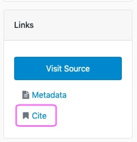

# Citing geospatial data

BTAA Geportal users will find information for citation elements in several places: within the geoportal itself, in metadata embedded in downloaded datasets, and from original data producer websites/portals. The Citation Guide offers helpful suggestions on the best places to find relevant citation content.

## Why citing data is important

**Citing data is an essential practice.** The act of referencing data sources not only acknowledges the contributions of others but also bolsters the credibility and reliability of one's own work. By attributing information to its rightful originators, citing data fosters a culture of transparency and accountability, allowing for the replication and verification of findings. Moreover, proper citation practices enable readers to delve deeper into the subject matter, trace the lineage of ideas, and build upon existing knowledge.

## What to include in a data citation

The BTAA Geospatial Information Network recommends compiling the information needed for citations by using elements identified in the [International Association for Social Science Information Services & technology (IASSIST) Quick Guide to Data Citation](https://www.google.com/url?q=https%3A%2F%2Fiassistdata.org%2F&sa=D&sntz=1&usg=AOvVaw3uyQef4eShx4NLB8sx2vkF).

* **Creator**: Name(s) of each individual or organizational entity responsible for the creation of the dataset. This is also called “Author.”
* **Date**: Year the dataset was published or issued.
* **Title**: Complete title of the dataset, including the edition or version number, if applicable. 
* **Publisher**: Organization that makes the dataset available by archiving, producing, publishing, and/or distributing the dataset. If the Publisher is not clear, look for an organization described in the metadata as the Distributor.
* **Identifier**:Electronic location, web address, or unique, persistent, global identifier used to locate the dataset (such as a DOI). Append the date retrieved if the title and locator are not specific to the exact instance of the data you used.
  
!!! example

	Dane County Land Information Office. (2019). Buildings Dane County, WI 2018. University of Wisconsin-Madison. https://gisdata.wisc.edu/public/Dane_Buildings_2018.zip 

## How to gather information in the BTAA Geoportal for citation elements

### Use the Cite button
The BTAA Geoportal offers a built-in citation tool that automatically takes information from metadata associated with data or maps and constructs a citation on-the-fly.  Look for the “Cite” button at the right side of a data or map record information page. This will produce a style-agnostic citation matching the IASSIST profile. Users can copy the information in one click.

!!! warning

	If users need to conform to a standard style (such as MLA or APA), they will need to reformat the generated citation for their publication.

<figure markdown>
  { width="300" }
  <figcaption>Cite button found on every Geoportal item view page</figcaption>
</figure>

### Other options

In some cases, the Geoportal's item view may not contain sufficient information for a citation, and users may need to investigate further. Here are options for finding the rest of the citation elements:

- **View the supplemental metadata**: Look for a “View Metadata” option under the Links toolbar. If present, supplemental metadata will display in the geoportal.
- **Download the dataset**: There may be detailed metadata embedded within the file itself or attached as a separate document.
- **Click the “View Source” button**: This will direct users the original data provider’s website, which may include the needed metadata.
- **Email the data provider**: The original data provider should have a contact listed on their website.

## Styling the citation

How you style or punctuate these elements will depend on your chosen citation style (e.g. MLA, APA, Chicago, etc). 
