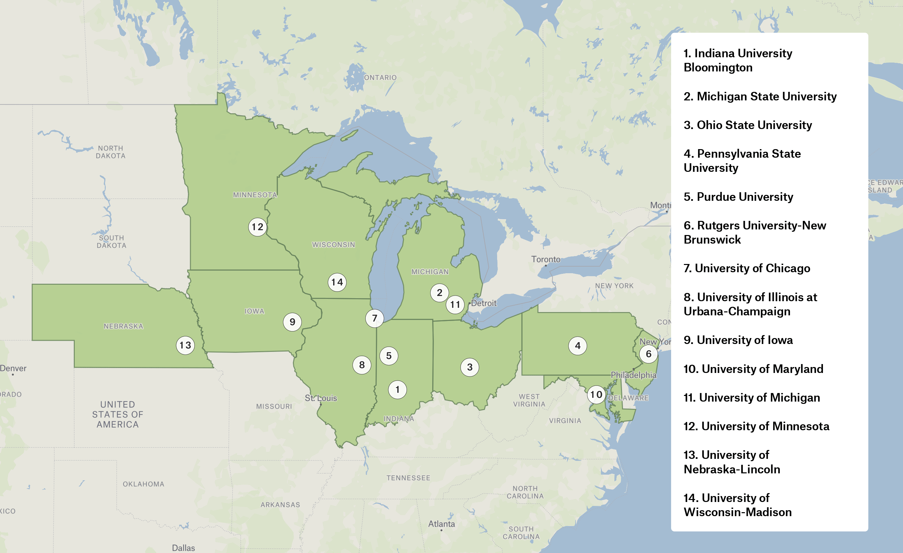

---
hide:
 - navigation
 - toc
---

<body>

	

	    <h1>The Big Ten Academic Alliance Geospatial Information Network</h1>
	    
Supporting the geospatial research community and fostering connections among geospatial library professionals

	    

	        <a href="https://geo.btaa.org" class="hero-button">Explore the BTAA Geoportal</a>
	    

	

    

    
        

            <h2 class="grid-title">Find and Use Geospatial Resources</h2>
            
Learn how to find and use geospatial resources with our Tutorials and Research Guides.

            

                <a href="tutorials">Tutorials</a> |
                <a href="guides">Research Guides</a>
            

    	

        
        

            <h2 class="grid-title">Collaborate & Contribute</h2>
            
Collaborative activities, best practices, software projects, and metadata workflows.

            

                <a href="technology">Technology</a> |
                <a href="technology/metadataHandbook">Metadata Handbook</a>
            

        

        
        

            <h2 class="grid-title"> Stay Informed & Support Our Vision</h2>
            
Project updates, program guidelines, history, and milestones.

            

                <a href="about/index">About</a> |
                <a href="about/history">History</a>
            

        

        
    

    

<h2>Participating Institutions</h2>
    

  
</body>
</html>

