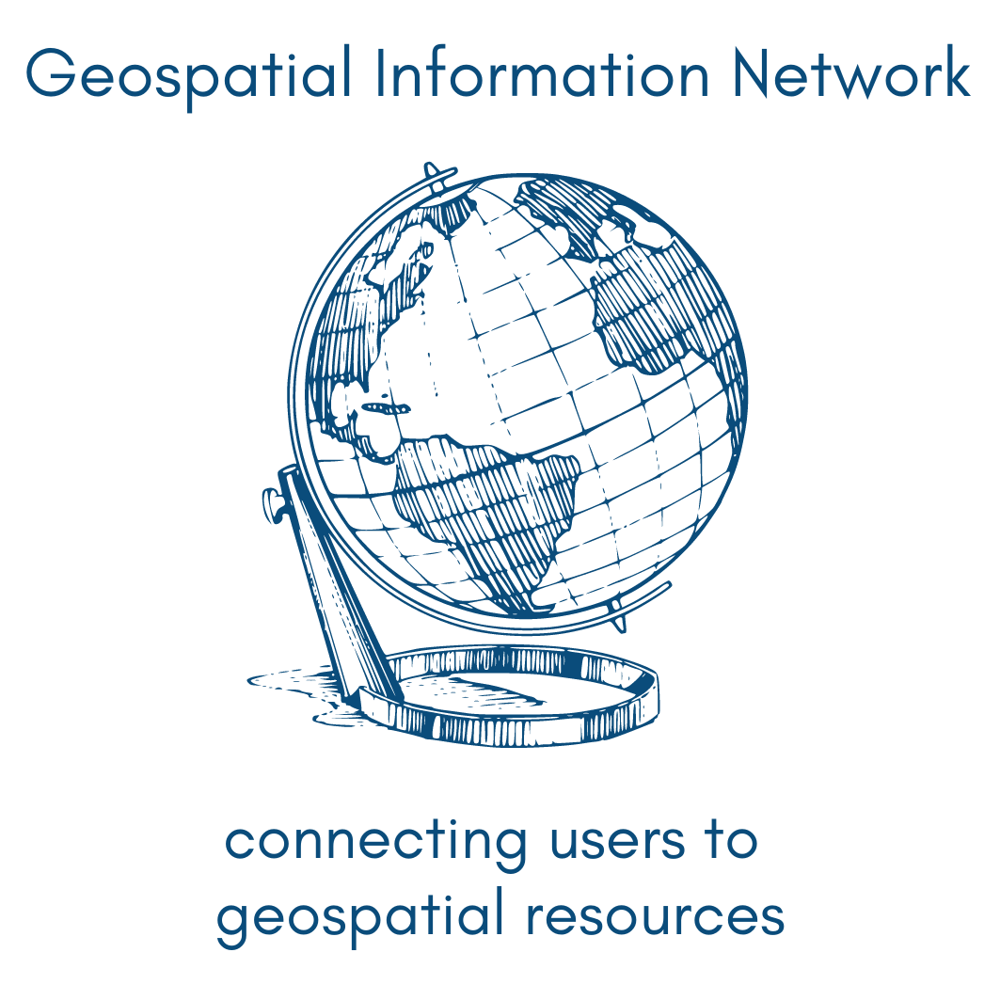

---
hide:
 - navigation
 - toc
---

<!---->

!!! warning

	This site is a work in progress. In the meantime, visit our current website at [https://z.umn.edu/geobtaa](https://z.umn.edu/geobtaa)

{ align=left ; width="400" }

The Big Ten Academic Alliance Geospatial Information Network (BTAA-GIN) is  a collaboration of librarians and geospatial specialists from fourteen universities in the <a href = "https://btaa.org">Big Ten Academic Alliance</a>. Together, they maintain the BTAA Geoportal, create educational materials, document best practices for geospatial libraries, and contribute to the free and open source software community.

 
 

- ###  :fontawesome-solid-chalkboard-user: [User Resources ](tutorials)
Learn how to find and use geospatial resources with our Tutorials and Research Guides
{ .card  }

- ###  :material-chart-pie-outline: [Program Documentation](geoportal)
View documentation about the BTAA Geoportal, our metadata workflows, and our program guidelines.
{ .card  }

 

 

- ###  :octicons-book-24: [Publications](news)
Read our blog, journal articles, and presentations.
{ .card  }

 - ###  :octicons-people-24: [About us](about-btaa-gin)
Find out more about our network and collaborative activites across the Big Ten Academic Alliance.
{ .card  }

 
 
## External links to our project sites

 
- ### :material-map: [BTAA Geoportal :octicons-link-external-16:](https://geo.btaa.org) 
 Search for data and maps in the BTAA Geoportal 

- ###  :fontawesome-solid-blog: [Blog :octicons-link-external-16:](https://geobtaa.blogspot.com) 
Read about interesting resources in our collections blog 

- ### :material-book-cog: [Metadata Handbook :octicons-link-external-16:](https://z.umn.edu/gbl-handbook)
Consult our Metadata Handbook.

