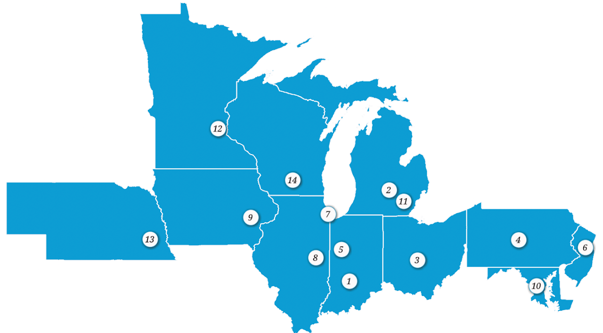

---
hide:
  - toc
---

This Big Ten Academic Alliance Geospatial Information Network (BTAA-GIN) is collectively managed by librarians and geospatial specialists from fourteen universities in the Big Ten Academic Alliance. 

1. Indiana University Bloomington
2. Michigan State University
3. Ohio State University
4. Pennsylvania State University
5. Purdue University
6. Rutgers University-New Brunswick
7. University of Chicago
8. University of Illinois at Urbana­-Champaign
9. University of Iowa
10. University of Maryland
11. University of Michigan
12. University of Minnesota
13. University of Nebraska-Lincoln
14. University of Wisconsin-­Madison