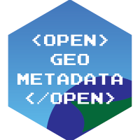

The BTAA-GIN actively supports and contributes to the following free and open-source communities:

[GeoBlacklight](https://geoblacklight.org)

[OpenGeoMetadata](https://opengeometadata.org)

[Geo4LibCamp](https://geo4libcamp.org)